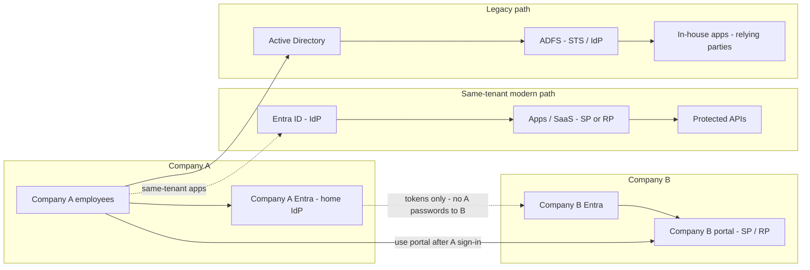
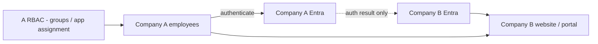
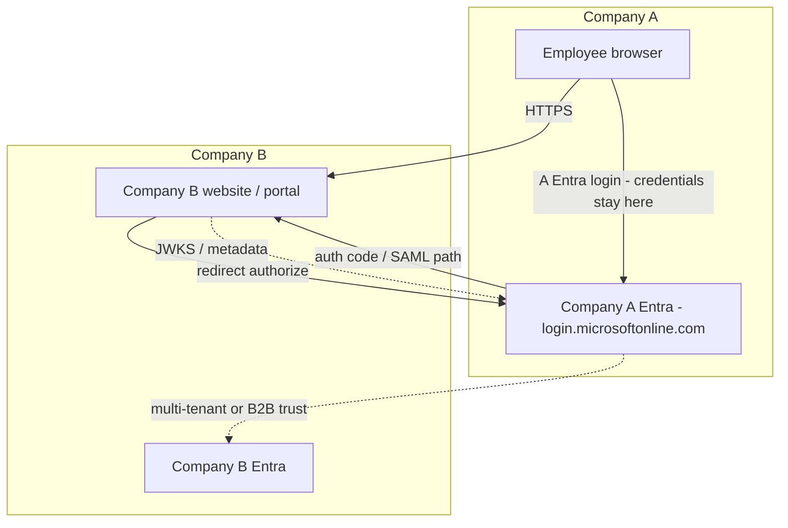
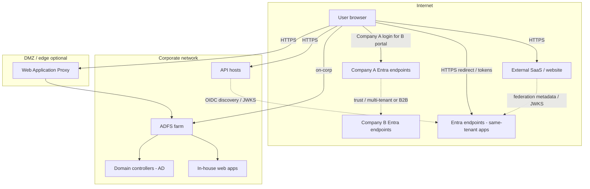

# Components and network topology

This page is the **landscape-wide** view: modern Entra, legacy ADFS, and the **Company A → Company B portal** cross-federation scenario on one canvas. Use it for stakeholder orientation across the whole estate.

For diagrams scoped to a single decision pattern, open that pattern doc instead:

| Pattern | Focused component + network diagrams |
|---|---|
| Browser SSO (SAML / OIDC) | [03 — Browser SSO](./03-browser-sso-saml-oidc.md#components-and-network-topology) |
| API OAuth / OBO | [04 — API OAuth and OBO](./04-api-oauth-obo.md#components-and-network-topology) |
| Cross-federation (A → B portal) | [05 — Cross-federation](./05-cross-federation.md#components-and-network-topology) |
| Legacy ADFS / AD | [06 — Legacy ADFS and AD](./06-legacy-adfs-ad.md#components-and-network-topology) |

## High-level components (all patterns)

Enterprise SSO spans a **modern Entra** plane, a **legacy ADFS** plane, and **cross-federation** when one company’s employees use another company’s portal.

**Modern Entra path (your org → SaaS or your apps):** **Your** employees (members of **your** Entra tenant) authenticate to **your** Entra ID. Apps register as **SAML SPs** or **OIDC RPs**. APIs validate **OAuth access tokens**. This **is federation** — your tenant trusts an external service provider (SaaS vendor) or your own app — but it is **not** cross-federation (see below).

**Legacy ADFS path:** Users authenticate through **ADFS** against **Active Directory**. In-house apps are relying parties (WS-Fed / SAML).

**Cross-federation (your org → third-party partner’s portal):** In this reference, **Company A = your organization** and **Company B = a third-party partner** (not a commercial SaaS product). **Your employees** need the **partner’s own website/portal** (built and hosted in the partner’s identity estate). They sign in only on **your Entra** login page. **Credentials never pass through the partner.** **You manage RBAC** for which of your employees may use the portal. There is **no separate partner-user login** — only your workforce authenticates, always at your Entra.

### Federation vs cross-federation (both are federation)

**Cross-federation is not a fallback for when a partner “can’t do federation.”** Both patterns use federation (SAML/OIDC trust). The choice is **which integration model** applies:

| Question | **Browser SSO** (Modern Entra path) | **Cross-federation** (your org → partner portal) |
|---|---|---|
| **Who are the users?** | **Your** employees (your tenant members) | **Your** employees |
| **What are they accessing?** | A **commercial SaaS product** (Salesforce, ServiceNow, Zoom, etc.) or **your own** app in your tenant | The **partner’s custom portal/app** hosted in the **partner’s** tenant |
| **Who is the “third party”?** | **SaaS vendor** — sells a standard product with enterprise SSO | **Business partner** — operates their own line-of-business application |
| **Where is federation configured?** | **Your** Entra: enterprise application to the vendor’s SP | **Trust between two orgs**: multi-tenant app (you consent + assign) or B2B + group sync |
| **Who manages “who can access”?** | **You**, in **your** tenant (assign users/groups to the SaaS enterprise app) | **You**, in **your** tenant (multi-tenant assignment) or via synced groups — see [05](./05-cross-federation.md) |
| **Typical login** | Your Entra login page | **Your** Entra login page (credentials stay with you) |

**Choose Browser SSO (03)** when the third party is a **SaaS vendor** and you are federating your workforce into **their product** using the vendor’s standard enterprise SSO (gallery app, SAML/OIDC metadata they publish for customers).

**Choose cross-federation (05)** when the third party is a **partner** and your workforce must use **the partner’s portal** (supplier hub, collaboration site, joint platform) with **your** Entra login, **no** credential passthrough to the partner, and **your** org controlling which employees get access.

**Do not** pick cross-federation only because a partner “doesn’t support federation.” If they offer a SaaS product with enterprise SSO, use **Browser SSO**. Use **cross-federation** when the workload is the **partner’s tenant-hosted application**, not a shared commercial SaaS SKU.

## Cross-federation: your organization → third-party partner

In this reference: **Company A = your organization**, **Company B = a third-party partner** (supplier, customer, joint-venture counterparty) hosting **their own** portal — not a commercial SaaS vendor like Salesforce.

Primary requirements for this path (detail in [05](./05-cross-federation.md)):

1. A employees access B’s portal  
2. Login UI is **Company A Entra**  
3. A credentials **do not** pass through B  
4. **A manages RBAC** for its employees (multi-tenant app assignment in A, or A→B group sync)

### Network topology (Company A → Company B)

**Credential boundary:** passwords and MFA for Company A employees are entered only at **Company A Entra**. Company B receives redirects and tokens — never A’s secrets. No second “partner login” step for this population.

## Network topology (logical, all patterns)

Traffic is **TLS everywhere on the wire**. Browser redirects carry authorization codes or SAML responses and cross **trust boundaries** between the user agent, IdP endpoints, and application origins—validate redirect URIs and registered reply URLs. **Federation metadata** (SAML metadata, OIDC discovery, JWKS, trust certificates) is **control-plane** configuration exchanged between IdPs and admins; it is not end-user traffic. Resource servers **validate bearer tokens locally** using signing keys from that metadata—routine API traffic does not call Entra on every request. **Tokens should not be forwarded unnecessarily**—APIs validate at the edge; avoid passing bearer tokens through additional hops or logging them.

## How to use these diagrams

**Architects** use this landscape view to show how same-tenant Entra, legacy ADFS, and **Company A → Company B** portal access coexist. For the A→B initiative alone, use the [cross-federation section above](#cross-federation-company-a--company-b) or the focused diagrams in [05](./05-cross-federation.md). **Developers** map their application to the **SP/RP** or **API** boxes on the matching pattern page.

## Related

- [01 — Enterprise SSO landscape](./01-sso-landscape.md)
- [03 — Browser SSO (SAML / OIDC)](./03-browser-sso-saml-oidc.md)
- [04 — API OAuth and OBO](./04-api-oauth-obo.md)
- [05 — Cross-federation (A → B portal)](./05-cross-federation.md)
- [06 — Legacy ADFS and AD](./06-legacy-adfs-ad.md)
- [07 — Key configurations](./07-key-configurations.md)
- [Glossary](./glossary.md)
