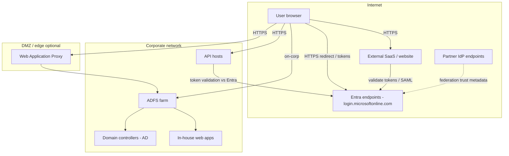

# Components and network topology

## High-level components

Enterprise SSO spans two identity planes on the corporate side and a partner federation path for external users.

**Modern Entra path:** Corporate users authenticate to **Entra ID**, which acts as the IdP. Enterprise applications and SaaS integrations register as **SPs or RPs**; first-party **APIs** validate tokens issued by Entra (OIDC ID tokens, OAuth access tokens). This is the default for new cloud and hybrid workloads.

**Legacy ADFS path:** Users whose sessions still originate in **Active Directory** authenticate through **ADFS** (STS / IdP). **In-house apps** on the corporate network act as relying parties and consume WS-Federation or SAML tokens. This path remains when apps, users, or trust relationships are AD-centric.

**Partner federation side path:** **Partner users** sign in at their home **Partner IdP** (Okta, Ping, or partner Entra). Inbound federation or B2B routes them to your **Entra ID** tenant, which then issues tokens to your applications—the same SP/RP/API boxes as the modern path.

## Network topology (logical)

Traffic is **TLS everywhere on the wire**. Browser redirects carry authorization codes or SAML responses and cross **trust boundaries** between the user agent, IdP endpoints, and application origins—design redirect URIs and CORS accordingly. **Federation metadata** (SAML metadata, OIDC discovery, trust certificates) is **control-plane** configuration exchanged between IdPs and admins; it is not end-user traffic. **Tokens should not be forwarded unnecessarily**—APIs validate at the edge; avoid passing bearer tokens through additional hops or logging them.

## How to use these diagrams

**Architects** use these views in stakeholder reviews to show where identity trust lives, which network zones see redirects, and how modern Entra, legacy ADFS, and partner federation coexist. **Developers** map their application to the **SP/RP** or **API** boxes, then follow the pattern doc that matches their protocol (SAML/OIDC browser SSO, OAuth to APIs, or legacy WS-Fed/SAML to ADFS).

## Related

- [01 — Enterprise SSO landscape](./01-sso-landscape.md)
- [03 — Browser SSO (SAML / OIDC)](./03-browser-sso-saml-oidc.md)
- [04 — API OAuth and OBO](./04-api-oauth-obo.md)
- [05 — Cross-federation](./05-cross-federation.md)
- [06 — Legacy ADFS and AD](./06-legacy-adfs-ad.md)
- [Glossary](./glossary.md)
