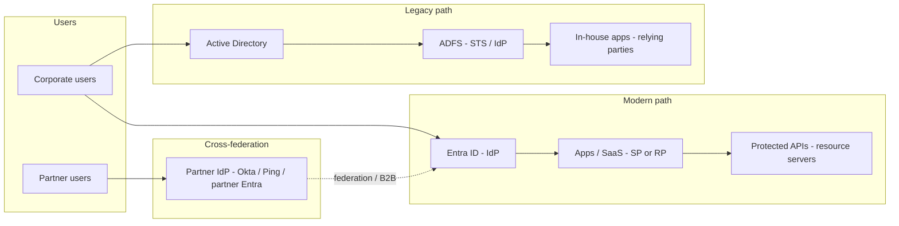
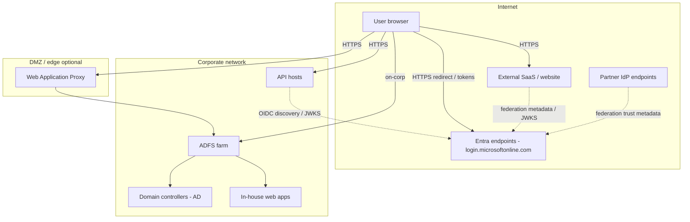

# Components and network topology

This page is the **landscape-wide** view: modern Entra, legacy ADFS, and cross-federation on one canvas. Use it for stakeholder orientation across the whole estate.

For diagrams scoped to a single decision pattern, open that pattern doc instead:

| Pattern | Focused component + network diagrams |
|---|---|
| Browser SSO (SAML / OIDC) | [03 — Browser SSO](./03-browser-sso-saml-oidc.md#components-and-network-topology) |
| API OAuth / OBO | [04 — API OAuth and OBO](./04-api-oauth-obo.md#components-and-network-topology) |
| Cross-federation | [05 — Cross-federation](./05-cross-federation.md#components-and-network-topology) |
| Legacy ADFS / AD | [06 — Legacy ADFS and AD](./06-legacy-adfs-ad.md#components-and-network-topology) |

## High-level components (all patterns)

Enterprise SSO spans two identity planes on the corporate side and a partner federation path for external users.

**Modern Entra path:** Corporate users authenticate to **Entra ID**, which acts as the IdP. Enterprise applications and SaaS integrations register as **SAML SPs** or **OIDC RPs**: SAML SPs consume **assertions**; OIDC RPs validate **ID tokens** to establish user sessions (often server-side). First-party **APIs** validate **OAuth access tokens** (audience, issuer, signature, scopes). This is the default for new cloud and hybrid workloads.

**Legacy ADFS path:** Users whose sessions still originate in **Active Directory** authenticate through **ADFS** (STS / IdP). **In-house apps** on the corporate network act as relying parties and consume WS-Federation or SAML tokens. This path remains when apps, users, or trust relationships are AD-centric.

**Partner federation side path:** **Partner users** sign in at their home **Partner IdP** (Okta, Ping, or partner Entra). Inbound federation or B2B routes them to your **Entra ID** tenant, which then issues tokens to your applications—the same SP/RP/API boxes as the modern path.

## Network topology (logical, all patterns)

Traffic is **TLS everywhere on the wire**. Browser redirects carry authorization codes or SAML responses and cross **trust boundaries** between the user agent, IdP endpoints, and application origins—validate redirect URIs and registered reply URLs. **Federation metadata** (SAML metadata, OIDC discovery, JWKS, trust certificates) is **control-plane** configuration exchanged between IdPs and admins; it is not end-user traffic. Resource servers **validate bearer tokens locally** using signing keys from that metadata—routine API traffic does not call Entra on every request. **Tokens should not be forwarded unnecessarily**—APIs validate at the edge; avoid passing bearer tokens through additional hops or logging them.

## How to use these diagrams

**Architects** use this landscape view to show how modern Entra, legacy ADFS, and partner federation coexist. For a single initiative, switch to the **pattern-specific** component and network diagrams in [03](./03-browser-sso-saml-oidc.md)–[06](./06-legacy-adfs-ad.md) so stakeholders only see the actors and zones that apply. **Developers** map their application to the **SP/RP** or **API** boxes on the matching pattern page.

## Related

- [01 — Enterprise SSO landscape](./01-sso-landscape.md)
- [03 — Browser SSO (SAML / OIDC)](./03-browser-sso-saml-oidc.md)
- [04 — API OAuth and OBO](./04-api-oauth-obo.md)
- [05 — Cross-federation](./05-cross-federation.md)
- [06 — Legacy ADFS and AD](./06-legacy-adfs-ad.md)
- [07 — Key configurations](./07-key-configurations.md)
- [Glossary](./glossary.md)
