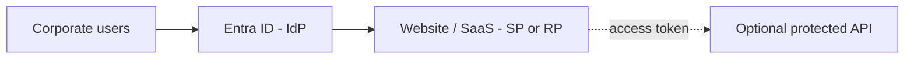
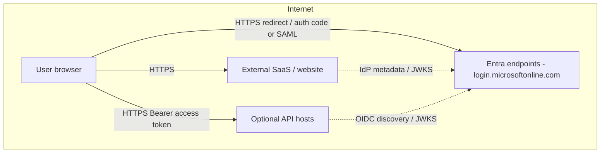
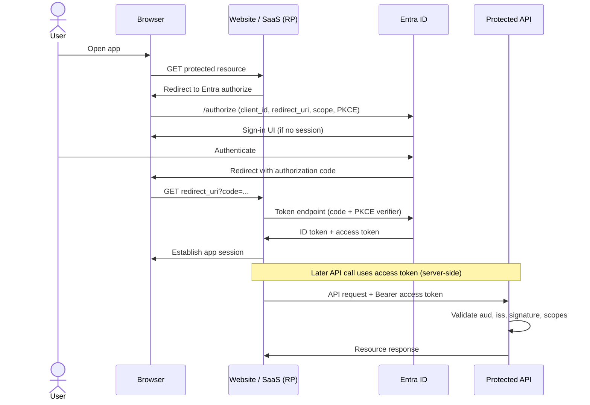
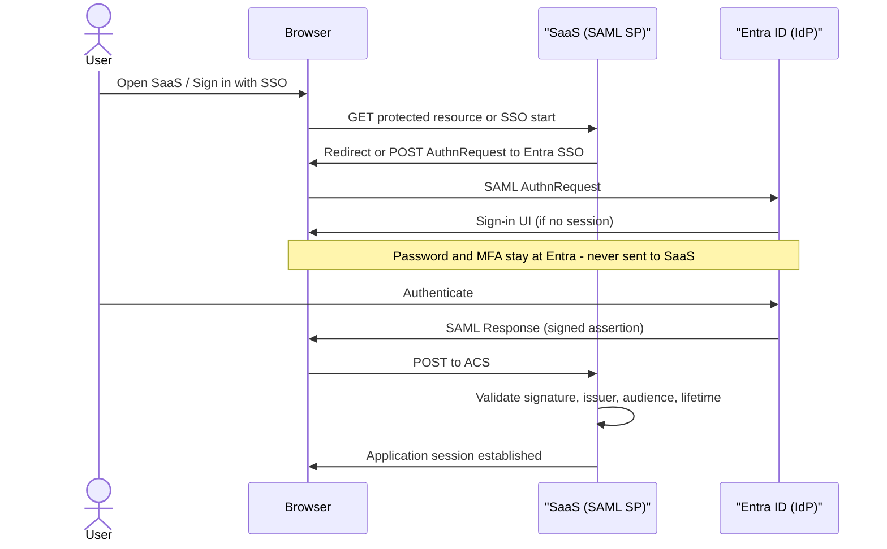

# Browser SSO with Entra ID (SAML and OIDC)

## Choose this when

- Users sign in through a **browser** to a **SaaS product** or **external website** integrated with your Entra tenant
- The application is registered as an **enterprise application** (SAML SP or OIDC RP) and you need a conceptual map of redirects, tokens, and session establishment
- The same sign-in flow may later call **protected APIs** with delegated OAuth access tokens (see [04](./04-api-oauth-obo.md))

## Prefer another pattern when

- **APIs only / no browser** (daemon, service-to-service, no interactive login) → [04 — API OAuth and OBO](./04-api-oauth-obo.md)
- **Partner users need home-IdP auth** (their Okta, Ping, or Entra tenant) → [05 — Cross-federation](./05-cross-federation.md)
- **In-house ADFS-only stack** on the corporate network with WS-Fed or SAML to on-prem AD → [06 — Legacy ADFS and AD](./06-legacy-adfs-ad.md)

## Actors

| Actor | Role |
|---|---|
| User browser | Initiates sign-in; follows redirects; holds no long-lived secrets (PKCE verifier is ephemeral) |
| Entra ID | IdP — authenticates the user, issues SAML assertions or OIDC tokens |
| External website / SaaS | **SP** (SAML) or **RP** (OIDC) — consumes federation result and establishes an application session |
| Optional API | **Resource server** — validates OAuth **access tokens** for API calls (see [04](./04-api-oauth-obo.md)) |

## Components and network topology

Focused views for **browser SSO via Entra** only. Landscape-wide diagrams (Entra + ADFS + partners together) live in [02](./02-components-and-topology.md).

### High-level components

### Network topology (logical)

Browser redirects cross the Entra ↔ app trust boundary; SaaS and APIs validate federation artifacts and access tokens **locally** using metadata/JWKS (control plane), not by calling Entra on every request.

## Protocols

- Prefer **OIDC** for modern apps and first-party web/SPA workloads when both Entra and the vendor support it
- Use **SAML 2.0** when the SaaS vendor requires it (common for older enterprise SaaS) or when OIDC is unavailable
- Both protocols achieve the same outcome: the user authenticates at Entra and the application receives proof of identity to create a session

### Key difference: how Entra and the SaaS “integrate”

| | **SAML 2.0** | **OpenID Connect** |
|---|---|---|
| **Trust / integration model** | **Configuration-based federation** — exchange metadata and register endpoints/certs once (enterprise app ↔ SaaS admin). **Not** an API-call integration between Entra and the SaaS for login | **Configuration plus runtime HTTP to Entra** — app registration + discovery/JWKS, and typically a **token-endpoint** call (app → Entra) to exchange the authorization code for tokens |
| **During sign-in** | Browser carries AuthnRequest / SAML Response; SaaS validates assertion **locally** with the IdP signing cert | Browser hits `/authorize`; confidential apps then call Entra’s **token endpoint** (back channel) for ID/access tokens |
| **Passwords** | Stay at Entra — never sent to the SaaS | Stay at Entra — never sent to the SaaS |

**Rule of thumb:** SAML trust is **direct via configuration (metadata)**, not via Entra↔SaaS API integration. OIDC still uses config for trust, but the **authorization-code** path adds a **live HTTP API call** from the app to Entra’s token endpoint — that back-channel step is a major difference from classic SAML browser SSO.

| Aspect | SAML 2.0 | OpenID Connect |
|---|---|---|
| Trust setup | SAML metadata (entity ID, ACS, signing cert) — **config only** | OIDC discovery + app registration (client ID, redirect URIs) |
| Runtime Entra API call for tokens | **No** (assertion arrives via browser POST to ACS) | **Yes** (typical): token endpoint after `/authorize` |
| Identity artifact | Signed **XML assertion** (claims inside assertion) | **ID token** (JWT) + optional **access token** |
| Browser return path | HTTP POST to **ACS** (Assertion Consumer Service) | Redirect to **redirect URI** with authorization code |
| API access | Not native — separate OAuth integration if APIs are needed | **Access token** with scopes for resource APIs |
| Typical SaaS fit | Legacy / vendor-mandated enterprise apps | Modern SaaS, first-party web, SPA with PKCE |

## Example: external website / SaaS via Entra

An enterprise registers the SaaS product in Entra as an **enterprise application** (SAML) or **app registration** exposed to the tenant (OIDC). Administrators configure **who may sign in** (assignment, groups) and **what Entra sends outbound** (UPN, email, display name, group claims).

For **OIDC**, the vendor supplies a redirect URI; Entra registers that URI and issues a **client ID** (and often a client secret for confidential web apps). The app requests scopes such as `openid profile email` for sign-in and additional API scopes if the same registration calls your APIs.

For **SAML**, the vendor (SP) supplies an **entity ID** and **ACS URL** — you register that ACS (reply URL) in Entra. Entra publishes **IdP metadata**: SSO endpoint, issuer, and signing certificate. Attribute mappings translate directory fields into SAML claim types the SaaS expects.

After successful authentication, the application creates its **own session** (cookie or server-side store). Federation tokens or assertions prove identity once at login; they are not a substitute for the app's session management or for API authorization.

## Sequence: OIDC authorization code (then API)

The **ID token** tells the RP who signed in; the **access token** authorizes calls to APIs whose audience and scopes match. Do not send ID tokens to resource APIs—APIs expect access tokens with the correct `aud` and scopes (see [glossary — ID token](./glossary.md#id-token) and [glossary — access token](./glossary.md#access-token)).

> **Note:** This sequence reflects a **confidential web app** or **BFF**: the server exchanges the code and holds the access token, then calls APIs on the user's behalf. For **public-client SPAs**, the browser completes the code+PKCE exchange, holds the access token, and calls the API directly.

> **Contrast with SAML:** the `App->>Entra: Token endpoint` step is an **OIDC/OAuth runtime API call**. Classic SAML browser SSO has **no** equivalent — trust is configuration/metadata, and the assertion arrives via browser POST to the ACS (see [SAML SP-initiated](#saml-sp-initiated)).

## SAML SP-initiated

Same SSO outcome as OIDC: user ends up signed in to the SaaS with an Entra-backed identity. SAML exchanges a signed **XML assertion** instead of OIDC JWTs.

### Is SAML a “direct” integration between Entra and the SaaS?

**Yes — direct federation via configuration (metadata), not via API-call integration.** You create an **enterprise application** in Entra and exchange **SAML metadata** with the SaaS (entity IDs, ACS URL, IdP SSO endpoint, signing certificate). That establishes trust between Entra (IdP) and the SaaS (SP). There is **no** requirement for Entra and the SaaS to call each other’s APIs to set up or complete login.

**Contrast with OIDC:** OIDC also starts with configuration (app registration, redirect URIs), but the common authorization-code flow then uses a **runtime HTTP call** to Entra’s **token endpoint** (app → Entra) to obtain tokens. SAML browser SSO has **no equivalent token-endpoint step** — the signed assertion is delivered by the **browser POST to the ACS**, then validated locally.

**Credentials:** passwords and MFA stay at Entra; they are never posted to the SaaS.

- **SP-initiated** (above) is the common SaaS path: user starts at the SaaS, which sends them to Entra.
- **IdP-initiated** (optional): user starts from an Entra/My Apps tile; Entra POSTs a SAML Response to the ACS without a prior AuthnRequest. Same trust; different entry point.
- **Single Logout** (optional) needs coordinated logout URLs on both sides — often incomplete in SaaS; plan session expiry accordingly.
- SAML browser SSO does **not** produce OAuth access tokens for your APIs; use a separate OAuth integration if APIs are required (see [04](./04-api-oauth-obo.md)).
## Key configurations

Detailed checklists and Entra field names live in [07 — Key configurations](./07-key-configurations.md). For browser SSO, confirm at minimum:

- **Tenant / issuer** — Entra tenant ID and issuer URL match what the SP/RP validates
- **Client / app ID** — OIDC client ID or SAML entity ID registered on both sides
- **Redirect URI or ACS** — exact match including scheme, host, path, and trailing slash
- **Logout URL** — federated sign-out endpoint if the app supports SLO
- **Claims** — UPN, email, display name, and group claims mapped to what the app expects
- **SAML signing certificate** — IdP signing cert from Entra metadata; plan rollover before expiry

## Common pitfalls

- **Wrong reply URL or redirect URI** — Entra rejects mismatches; SaaS upgrades sometimes change ACS paths without notice
- **Clock skew** — SAML `NotOnOrAfter` and JWT `exp` fail validation if server clocks drift; sync NTP on app servers
- **Missing `openid` scope** — OIDC sign-in requires `openid`; without it you may get an access token but no ID token
- **ID token vs access token for APIs** — sending the ID token to an API causes 401/403; APIs need an access token whose `aud` matches the API
- **Group overage** — large group memberships exceed token size limits; use app roles, filtered groups, or Microsoft Graph on the server instead of embedding every group in the token

## Related

- [01 — Enterprise SSO landscape](./01-sso-landscape.md)
- [02 — Components and network topology](./02-components-and-topology.md)
- [04 — API OAuth and OBO](./04-api-oauth-obo.md)
- [05 — Cross-federation](./05-cross-federation.md)
- [06 — Legacy ADFS and AD](./06-legacy-adfs-ad.md) — legacy ADFS alternative
- [07 — Key configurations](./07-key-configurations.md)
- [Glossary](./glossary.md)
