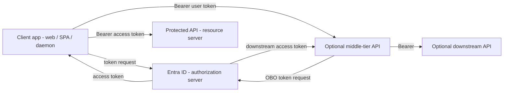
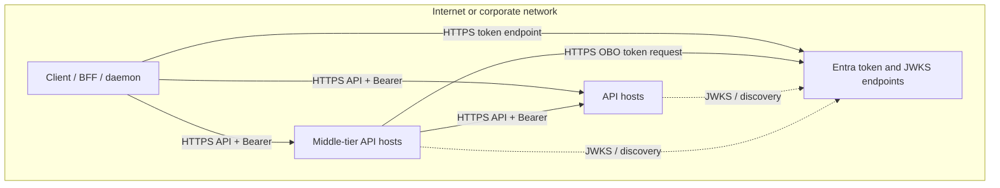
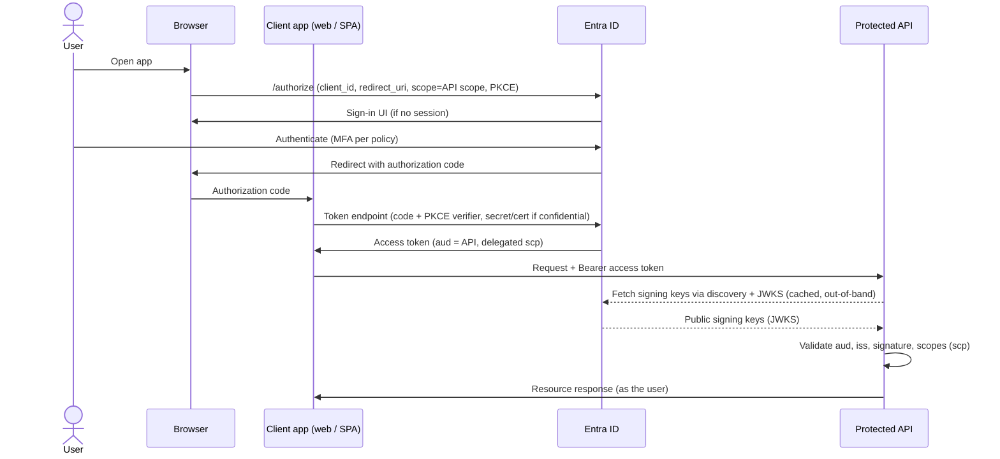
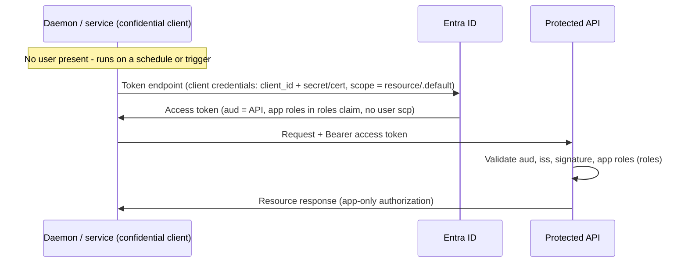
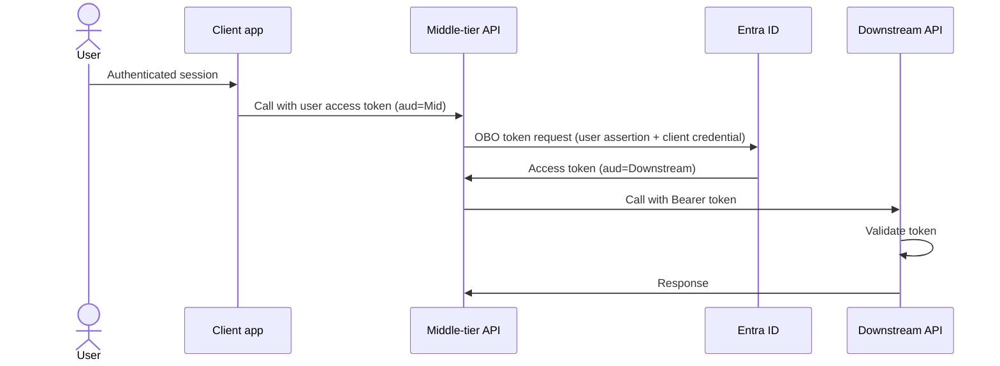

# API access with Entra ID (OAuth 2.0 and OBO)

## Choose this when

- A **client application** (web app, SPA, daemon, or API) must call **protected APIs** using **OAuth 2.0 access tokens**, not browser federation artifacts alone
- You need to decide between **delegated user access**, **app-only (client credentials)**, or **On-Behalf-Of (OBO)** when a middle tier calls downstream APIs with the signed-in user's context
- The user may already have authenticated via browser SSO ([03 — Browser SSO](./03-browser-sso-saml-oidc.md)); this doc covers how **access tokens** authorize API calls after or without that session

## Prefer another pattern when

- **Browser sign-in only** (SAML/OIDC to establish a SaaS session, no first-party API calls) → [03 — Browser SSO](./03-browser-sso-saml-oidc.md)
- **Partner users authenticate at their home IdP** (B2B guest or inbound federation) → [05 — Cross-federation](./05-cross-federation.md)
- **On-prem AD-backed apps** using ADFS (WS-Fed, SAML, or ADFS OIDC), not Entra OAuth → [06 — Legacy ADFS and AD](./06-legacy-adfs-ad.md)

## Actors

| Actor | Role |
|---|---|
| Client app | Requests tokens from Entra; presents access tokens to APIs (web/SPA, daemon, or middle tier) |
| Entra ID | Authorization server — authenticates users or clients; issues access (and optionally refresh) tokens |
| API (resource server) | Validates bearer tokens (`iss`, signature, `aud`, scopes/app roles, lifetime) before serving data |
| Middle-tier API (OBO only) | Receives the user's token (`aud` = middle tier), exchanges it at Entra for a downstream token, calls the downstream API |

## Components and network topology

Focused views for **API access via Entra OAuth** (delegated, app-only, OBO). Landscape-wide diagrams live in [02](./02-components-and-topology.md).

### High-level components

### Network topology (logical)

Clients and APIs reach Entra over TLS for **token issuance**; APIs validate bearer tokens locally with JWKS. OBO adds a middle-tier hop that calls Entra's token endpoint before calling the downstream API.

## Pattern A — Delegated user access (web/SPA → API)

**When:** A signed-in user (or interactive login) should call an API **as themselves**. The client obtains an access token with **delegated permissions** (scopes) that represent what the user is allowed to do.

**Flow:** Authorization code with **PKCE** for both public and confidential clients. Confidential clients also authenticate at the token endpoint with a client secret or certificate. After login, the token endpoint returns an **access token** whose **`aud`** (audience) is the target API—not the client app's ID. The **access token version** (and thus typical `aud` format) is controlled by the **resource API's** configuration (`accessTokenAcceptedVersion` / `requestedAccessTokenVersion`), not by whether the client calls the v1.0 or v2.0 token endpoint—either path can issue either format depending on that setting. **Version 1** tokens often use the API's **Application ID URI** (`api://…`) as `aud`; **version 2** tokens often use the API registration's **client ID (GUID)**. Validate against what Entra actually issues for each API registration. The client sends `Authorization: Bearer {access_token}` to the API.

**Scopes:** Request the narrowest delegated scopes the API exposes (e.g., `api://{api-app-id}/User.Read`). The API maps scopes (and optional claims) to authorization logic. Sign-in scopes (`openid`, `profile`, `email`) come from OIDC; **resource scopes** authorize API calls.

**Key configs (summary):** Application ID URI on the API registration; exposed scopes; admin consent (or user consent where allowed) for the calling app to receive delegated scopes; **authorized client applications** as optional **preauthorization** for trusted clients (can suppress consent prompts—not the sole gate for token issuance); API-side **audience validation** must match the token's `aud`. See [07 — Key configurations](./07-key-configurations.md).

**Relationship to browser SSO:** [03](./03-browser-sso-saml-oidc.md) describes OIDC sign-in; the same app registration often requests both `openid` and API scopes in one authorize request, or a BFF exchanges the code server-side and calls APIs with the access token.

## Pattern B — App-only (daemon / service)

**When:** A **background job, daemon, or service** calls an API **without a user present**—scheduled sync, nightly batch, microservice-to-microservice where no human is signed in.

**Flow:** **Client credentials** grant. The confidential client authenticates to Entra with its client ID plus secret or certificate and requests an access token for the API. No user assertion is involved; authorization is based on **application permissions** (app roles) granted to the client, typically via `https://graph.microsoft.com/.default` or `api://{api-app-id}/.default` depending on the resource.

**Permissions:** Admin consent for **application permissions** (app roles defined on the API registration). The resulting token has **no user context**—no delegated `scp` claim—though it may still carry a `sub` identifying the service principal. Authorization is based on **application roles** (`roles`), not delegated scopes. Downstream APIs must enforce app-only authorization explicitly (role checks, separate endpoints, or deny user-context assumptions).

**Key configs (summary):** API exposes app roles; calling app has application permissions assigned; client uses certificate auth in production. See [07 — Key configurations](./07-key-configurations.md).

## Pattern C — On-Behalf-Of (API → API with user)

**When:** A **middle-tier API** receives a user's access token from a client, must call a **downstream API** while preserving **user context** (delegated permissions on the downstream resource), and should not expose downstream credentials or long-lived refresh tokens to the browser.

**Flow:** The client calls the middle tier with a bearer token whose `aud` is the **middle-tier API**. The middle tier uses Entra's **OBO** token exchange: it presents the user's access token (or assertion) plus its own client credential to Entra and receives a **new access token** whose `aud` is the **downstream API**. The middle tier calls the downstream API with that token.

**Requirements:** There is no permission literally named "OBO." The middle-tier app registration must have **delegated permissions** on the downstream API, with **prior user or admin consent** already granted for those scopes. On token exchange, **prefer** requesting the downstream resource's `/.default` scope (e.g., `api://{api-app-id}/.default`), which returns all statically consented delegated permissions for that registration on the resource. You may request specific downstream delegated scopes instead, but only when those scopes are **already consented**—OBO cannot prompt the user for new permissions mid-flow, so unconsented scopes fail. The downstream API validates the new token's `aud`, scopes, and user identity claims as usual. OBO is an Entra / Microsoft identity platform pattern—not a generic OAuth grant; other IdPs may use different token-exchange mechanisms.

**Key configs (summary):** Middle-tier confidential registration; **delegated permissions** on the downstream API (consented before exchange); downstream Application ID URI and scopes; authorized client apps as optional preauthorization where applicable. See [07 — Key configurations](./07-key-configurations.md).

## Key configurations

Detailed checklists and Entra field names live in [07 — Key configurations](./07-key-configurations.md). For API access, confirm at minimum:

- **Application ID URI** — stable identifier used in scope names (`api://…/ScopeName`); whether `aud` is this URI or the API's client ID GUID depends on the API's **access token version** (`accessTokenAcceptedVersion` / `requestedAccessTokenVersion`), not the token endpoint path—do not assume URI always equals `aud`
- **Scopes (delegated)** — exposed permissions for user-delegated access (Pattern A and OBO downstream)
- **App roles / application permissions** — for client credentials (Pattern B) and admin-consented app-only access
- **Authorized client applications** — optional preauthorization for trusted clients; can suppress consent prompts, not the sole permission gate for token issuance
- **Audience validation** — API rejects tokens whose `aud` or `scp`/`roles` do not match its registration and configured access token version (not the token endpoint path)
- **Middle-tier delegated permissions (Pattern C)** — middle-tier app granted and consented for downstream delegated scopes before OBO exchange (no permission named "OBO")

## Common pitfalls

- **Wrong `aud`** — API validates against one identifier (Application ID URI or client ID GUID) while Entra issued a token whose `aud` matches the other form for that resource's access token version (or vice versa); every tier in OBO must accept the identifier Entra puts in the token for that API's configuration
- **Using ID token as API bearer** — ID tokens are for the client (`aud` = client app); resource APIs require **access tokens** with API audience and scopes
- **Missing downstream delegated permission or consent** — middle tier receives `invalid_grant` or downstream calls fail because the middle-tier registration lacks consented delegated permissions on the downstream resource, or consent was never granted before the OBO exchange
- **Confusing app-only with delegated** — client credentials tokens have no user context and no delegated `scp` (though `sub` may identify the service principal); do not use Pattern B when audit or authorization requires the signed-in user (use Pattern A or C)
- **Scope vs role mismatch** — delegated flows use `scp`; app-only uses `roles`; APIs must check the claim type that matches the grant

## Related

- [01 — Enterprise SSO landscape](./01-sso-landscape.md)
- [02 — Components and network topology](./02-components-and-topology.md)
- [03 — Browser SSO (SAML and OIDC)](./03-browser-sso-saml-oidc.md)
- [05 — Cross-federation](./05-cross-federation.md)
- [06 — Legacy ADFS and AD](./06-legacy-adfs-ad.md)
- [07 — Key configurations](./07-key-configurations.md)
- [Glossary](./glossary.md)
