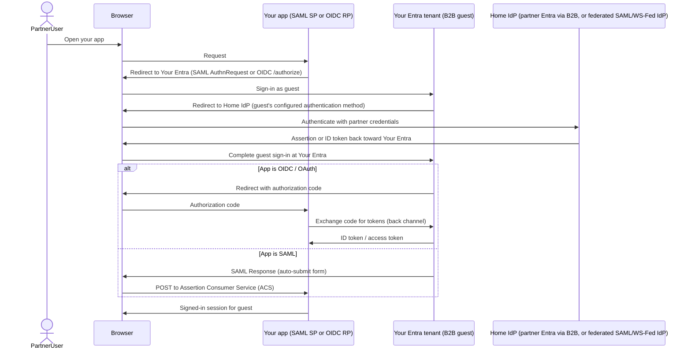

# Cross-federation and external identities

## Choose this when

- Users **belong to another organization** and need access to **your** Entra-integrated applications
- Partner users must **authenticate at their home IdP** — partner **Entra** (via B2B/cross-tenant access) or a **SAML 2.0 / WS-Fed** authority like **Okta**, **Ping**, or **ADFS** — rather than receiving credentials in your directory
- You are deciding **which authentication method** a B2B guest population should use to sign in: native Entra-to-Entra B2B, or B2B backed by a federated SAML/WS-Fed identity provider

## Prefer another pattern when

- **All users are members of your tenant only** (no external org identities) → [03 — Browser SSO](./03-browser-sso-saml-oidc.md) or [04 — API OAuth and OBO](./04-api-oauth-obo.md)
- **Pure on-prem ADFS internal** workloads backed by Active Directory, not Entra as the resource-tenant IdP → [06 — Legacy ADFS and AD](./06-legacy-adfs-ad.md)

## Where cross-federation sits

Your Entra tenant remains the **resource-tenant IdP** for your applications: SAML SPs, OIDC RPs, and OAuth APIs still trust **your** issuer and signing keys.

**Important:** in a workforce tenant, SAML/WS-Fed IdP federation is not an alternative *to* B2B — it is an **authentication method used by B2B collaboration**. A partner user still ends up with an identity in **your** tenant (typically a guest, or an external member via cross-tenant sync); federation only changes **where that identity's credentials are verified** (the partner's IdP instead of Entra-managed credentials or a one-time passcode). Self-service sign-up and entitlement management can remove the need for an administrator to send a manual invitation, but they still create and manage a guest lifecycle in your directory — federation does not, by itself, grant domain-wide access with no account in your tenant.

Partner users authenticate at their **home IdP** — the partner's own Entra tenant (via native B2B / cross-tenant access) or a federated SAML/WS-Fed provider such as Okta, Ping, or ADFS. Entra then completes the B2B guest sign-in and issues the same SAML assertions, OIDC tokens, or OAuth access tokens your apps already expect from member users.

See the **Partner federation** subgraph in [02 — Components and network topology](./02-components-and-topology.md#high-level-components): partner IdP endpoints exchange trust metadata with your Entra tenant; browser redirects cross that boundary before your app receives a session.

## Option A — Entra B2B collaboration, native Entra-to-Entra

**B2B collaboration** brings an external identity into your Entra tenant to access your applications, as a **guest** (most common) or, when the partner org enables it, an **external member** via cross-tenant synchronization. The object lives in your directory; the partner user does not become a full native member of your tenant.

**When the partner also uses Entra ID, prefer native B2B / cross-tenant access over configuring SAML federation between the two tenants.** Entra↔Entra collaboration uses **B2B collaboration** — which routes partner users to authenticate at their home tenant — together with **cross-tenant access settings** that govern inbound and outbound B2B trust between tenants. Inbound trust can accept MFA and device claims from the partner's home tenant; outbound settings control how your users access the partner tenant. Cross-tenant access settings alone do not replace that native B2B sign-in path. Onboarding still requires B2B invitation or self-service sign-up — not a custom SAML/WS-Fed identity provider. Treating "two Entra tenants" as a SAML-federation problem is a common misconfiguration.

**Lifecycle:** An administrator (or automated invitation flow) invites the partner user by email, or the partner self-service signs up (optionally gated by entitlement management) if your tenant allows it for their domain. The guest **redeems** the invitation — typically by signing in at their **home Entra tenant**, or via email one-time passcode when the partner has no Entra tenant and no federation is configured. Self-service and entitlement management reduce *manual* invite effort, but the resulting guest object, its lifecycle, and its access reviews still live in your tenant like any other B2B account.

**Authentication:** For **Entra↔Entra**, the guest signs in at **partner Entra**; native B2B collaboration routes authentication to the home tenant automatically, and cross-tenant access settings govern what inbound trust (for example, MFA and device claims from the home tenant) applies. Your apps see a guest (or external member) principal in **your** tenant with claims issued by your Entra. Partners without their own Entra tenant (Okta, Ping, ADFS, or similar) cannot use this native path — see Option B.

**When it fits:** Named partner individuals or small populations; you want **per-user visibility** in your tenant (assignment, audit, group membership); the partner org also uses Entra ID.

## Option B — B2B with a federated SAML/WS-Fed identity provider

When the partner org does **not** use Entra ID, configure their IdP — **Okta**, **Ping Identity**, **ADFS**, or another **SAML 2.0 or WS-Fed** authority — as a federated identity provider under Entra's external identity providers. Entra then routes matching B2B guest sign-ins to the partner IdP instead of using an Entra-managed password or email one-time passcode. **How** Entra associates a guest with that federation trust is configurable: **verified-domain mapping** is the most common pattern, but Entra also supports **unverified-domain** federation (with constraints) and **domainless SAML** routing via issuer association plus `domain_hint` where applicable.

This is still **B2B**: Entra still creates and manages a guest object for each partner user in your tenant. Federation only changes the guest's **authentication method** — where their credentials are verified — not whether an account exists or whether an invitation/onboarding step happens.

**Protocol scope:** **SAML 2.0 and WS-Fed** are the protocols for workforce B2B direct federation with an arbitrary partner IdP (Okta, Ping, ADFS, and similar). Google workspace federation is a separate, vendor-specific path. Inbound **OIDC identity provider federation** is an **Entra External ID** (CIAM / external-tenant) feature — **out of scope** for this workforce reference; do not treat it as an available pattern for federating partner workforce IdPs in a corporate tenant.

**Partner is another Entra tenant?** Don't configure it as a SAML/WS-Fed identity provider — use Option A (native B2B / cross-tenant access) instead.

**Key concepts (configuration level):**

- **Federation metadata URL** — partner publishes SAML metadata (or WS-Fed federation metadata); your Entra imports endpoints and signing certificates
- **Issuer URI** — the identifier your Entra expects on inbound assertions (`Issuer` / entity ID); must match partner configuration exactly
- **Federation routing (choose a pattern)** — multiple association models exist; pick the one that fits partner onboarding and domain control:
  - **Verified domain** — map a partner email domain (e.g., `partner.com`) to the federated IdP; guests whose UPN/email matches that domain are redirected to the partner sign-in flow. Most common when the partner domain is already verified in **their** (home) Entra tenant. Microsoft requires the domain **not** be verified in **your** (resource) tenant — do not add DNS verification for the partner domain in your tenant to enable this trust. Issuer URI must still match partner IdP configuration exactly. **Redemption order** applies during **invitation redemption** — it prioritizes identity providers when more than one could apply (notably SAML/WS-Fed federation vs. Microsoft Entra for verified domains), rather than acting as a general routing selector among all federation patterns on every sign-in.
  - **Unverified domain** — map a partner email domain **without** verifying it in your tenant first; supported with constraints (for example, domain-conflict rules and sign-in limitations may apply). Use when domain verification is impractical but domain-based routing still fits.
  - **Domainless SAML (issuer + hint)** — associate the trust primarily by **issuer** / metadata and route sign-in using **issuer association** plus **`domain_hint`** (or equivalent login hints) where applicable, without relying on a verified domain map. Confirm current Microsoft direct-federation guidance for your scenario before assuming domainless routing.
- **Inbound claim requirements** — Entra's federation trust expects fixed inbound claims per Microsoft documentation, protocol-specific: for **SAML 2.0**, a **persistent NameID** and a matchable **email address**; for **WS-Fed**, **ImmutableID** and **emailaddress**. These let Entra create or match the guest object. Federation configuration does not offer free-form inbound transform rules for groups, roles, or `preferred_username` the way an app's outbound claims do. Configure **your applications** separately to consume the claims Entra puts in the SAML assertion, OIDC ID token, or access token **after** B2B sign-in completes (see [03 — Browser SSO](./03-browser-sso-saml-oidc.md) and [07 — Key configurations](./07-key-configurations.md))

Any federation routing pattern still results in guest objects for that population — it changes *how* guests authenticate and can reduce reliance on per-user email OTP, but it does not remove the guest account, its assignment requirements, or its lifecycle review.

## B2B vs federated IdP (decision)

Both rows below are **B2B collaboration**. The decision is which **authentication method** the guest's home-tenant sign-in uses, and separately, which **onboarding path** creates the guest object.

| Aspect | Option A — native Entra home tenant | Option B — federated SAML/WS-Fed home IdP |
|---|---|---|
| **Home IdP / protocol** | Partner's own Entra tenant; cross-tenant access settings | Okta, Ping, ADFS, or other SAML 2.0 / WS-Fed authority configured as a federated identity provider |
| **Applies when** | Partner org uses Entra ID | Partner org does **not** use Entra ID |
| **Who manages credentials** | Partner org, in their Entra tenant | Partner org, in their SAML/WS-Fed IdP |
| **You configure** | Cross-tenant access settings (inbound/outbound B2B trust; inbound can accept home-tenant MFA and device claims) | Federated IdP metadata, issuer, and a federation routing pattern: verified domain (common), unverified domain (with constraints), or domainless SAML via issuer association + `domain_hint` where applicable |
| **Guest object in your tenant** | Yes — created by invitation, self-service sign-up, or cross-tenant sync | Yes — created on first sign-in or invitation; federation just points its auth at the partner IdP |

**Onboarding path (orthogonal to the table above, applies to either option):** a guest object can arrive via administrator invitation, self-service sign-up (optionally gated by entitlement management), or automated provisioning — independent of whether that guest's sign-in ultimately uses native Entra routing or a federated SAML/WS-Fed IdP.

## Sequence: partner user into your Entra app

Your Entra does not uniformly hand the browser "tokens" for every app: **OIDC/OAuth apps** redeem an authorization code for tokens over the back channel, while **SAML apps** receive a SAML response posted by the browser to the ACS endpoint — the same protocol mechanics as [03 — Browser SSO](./03-browser-sso-saml-oidc.md). Only the **upstream authentication path** (the redirect to the home IdP before Your Entra completes sign-in) is added by cross-federation; the app-facing protocol is unchanged.

## Key configurations

Detailed checklists and Entra field names live in [07 — Key configurations](./07-key-configurations.md). For cross-federation, confirm at minimum:

- **Federation metadata URL** — partner SAML metadata or WS-Fed federation metadata; refresh after partner certificate rollover
- **Issuer URI** — inbound issuer matches partner IdP entity ID (`Issuer` / entity ID); mismatch causes immediate sign-in failure
- **Federation routing / domain association** — confirm which pattern applies for Option B: **verified-domain** map (most common; partner domain verified in the **home** tenant, **not** in your resource tenant), **unverified-domain** map (with constraints), or **domainless SAML** via issuer association + `domain_hint` where applicable; for Option A (Entra↔Entra), **native B2B collaboration** routes authentication to the partner's home tenant — **cross-tenant access settings** control inbound/outbound B2B trust (for example, whether MFA or device claims from the home tenant are accepted), not the authentication routing path itself
- **Inbound claim requirements** — partner IdP must send the required inbound claims Entra expects: **persistent NameID** and email for **SAML 2.0**, or **ImmutableID** and **emailaddress** for **WS-Fed**; validate partner configuration against Microsoft's direct-federation claim requirements rather than assuming arbitrary inbound remap rules
- **Application outbound claims** — after B2B sign-in, configure each enterprise application or app registration for the UPN, email, display name, group, or role claims your **applications** need in **Entra-issued** assertions or tokens. Conditional Access evaluates sign-in conditions separately; it does not consume application outbound claim configuration
- **`userType`, licensing, and Conditional Access are distinct settings** — B2B collaboration users commonly default to `userType = Guest`, but licensing (e.g., external identity monthly active user billing), Conditional Access scoping (`All guest and external users` vs specific users/groups), and group assignment are each configured independently; don't assume setting `userType` alone determines every policy outcome
- **Application assignment** — enterprise applications and app registrations must allow guest access where partner users need entry; review default member-only assignments

## Common pitfalls

- **Verifying the partner domain in your resource tenant** — for verified-domain SAML/WS-Fed direct federation, the partner domain must be verified in the **partner's (home) Entra tenant**, not in your tenant; adding DNS verification for `partner.com` in your resource tenant conflicts with Microsoft's direct-federation requirements
- **Assuming verified domain is mandatory** — verified-domain mapping is the most common B2B direct-federation pattern, but Entra also supports unverified-domain federation (with constraints) and domainless SAML via issuer association + `domain_hint` where applicable; choose the routing pattern that matches partner domain control and onboarding constraints
- **Assuming federation removes the guest account** — SAML/WS-Fed IdP federation is an authentication method *for* B2B guests, not a replacement for one; any federation routing pattern still produces guest objects with a lifecycle, assignment, and access reviews in your tenant
- **Configuring SAML federation between two Entra tenants** — when the partner already has Entra ID, use native B2B collaboration and cross-tenant access settings (Option A), not a custom SAML/WS-Fed identity provider; treating Entra↔Entra as a generic SAML federation problem is unnecessary and harder to maintain
- **Expecting OIDC inbound IdP federation in a workforce tenant** — workforce B2B direct federation is **SAML 2.0 / WS-Fed only**. Inbound OIDC IdP federation belongs to **Entra External ID** (CIAM) scenarios and is **out of scope** here; do not plan a partner Okta/Ping federation around generic OIDC in a corporate workforce tenant
- **Treating guests like members** — guest users commonly default to `userType = Guest`, but licensing, Conditional Access, and group limits are separate settings; policies that assume `Member` user type or that assume `userType` alone drives every outcome can block partner access silently or at CA evaluation
- **Issuer mismatch** — partner rotates IdP certificates or changes entity ID without updating your federation trust; validate the issuer/entity ID and signing cert on every partner change
- **Assuming inbound federation claim transforms** — Entra's trust with the partner IdP enforces required inbound claims (SAML: persistent NameID and email; WS-Fed: ImmutableID and emailaddress), not arbitrary remap rules. If your app expects `preferred_username`, a specific SAML NameID format, or group claims, configure **outbound** claims on the Entra enterprise application or app registration for what Entra emits **after** guest sign-in — do not expect the federation trust itself to rewrite partner assertions freely
- **Confusing cross-tenant access settings with B2B routing** — cross-tenant access settings control inbound/outbound B2B trust between tenants (for example, whether to accept MFA or device claims from a partner's home tenant); native B2B collaboration is what routes partner Entra users to authenticate at their home tenant. Conditional Access evaluates sign-in conditions; it does not consume application outbound token claim configuration
- **Reply URL and redirect URI unchanged** — federation fixes upstream auth but your app's ACS/redirect URI must still match registration; partner federation does not relax SP/RP URL exact-match rules

## Related

- [01 — Enterprise SSO landscape](./01-sso-landscape.md)
- [02 — Components and network topology](./02-components-and-topology.md)
- [03 — Browser SSO (SAML / OIDC)](./03-browser-sso-saml-oidc.md)
- [04 — API OAuth and OBO](./04-api-oauth-obo.md)
- [06 — Legacy ADFS and AD](./06-legacy-adfs-ad.md)
- [07 — Key configurations](./07-key-configurations.md)
- [Glossary](./glossary.md)
