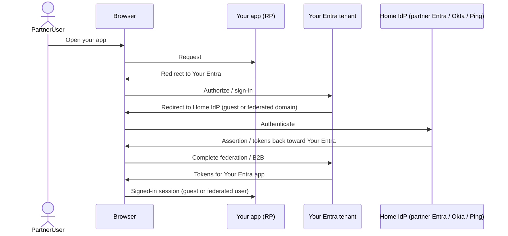

# Cross-federation and external identities

## Choose this when

- Users **belong to another organization** and need access to **your** Entra-integrated applications
- Partner users must **authenticate at their home IdP** — partner **Entra**, **Okta**, **Ping**, or another SAML/OIDC authority — rather than receiving credentials in your directory
- You are deciding between **Entra B2B guest users** and **inbound IdP federation** for the same partner population

## Prefer another pattern when

- **All users are members of your tenant only** (no external org identities) → [03 — Browser SSO](./03-browser-sso-saml-oidc.md) or [04 — API OAuth and OBO](./04-api-oauth-obo.md)
- **Pure on-prem ADFS internal** workloads backed by Active Directory, not Entra as the resource-tenant IdP → [06 — Legacy ADFS and AD](./06-legacy-adfs-ad.md)

## Where cross-federation sits

Your Entra tenant remains the **resource-tenant IdP** for your applications: SAML SPs, OIDC RPs, and OAuth APIs still trust **your** issuer and signing keys. Cross-federation adds a **home-IdP hop** before Entra issues tokens to your apps.

Partner users authenticate at their **home IdP** (partner Entra, Okta, Ping, or another SAML/OIDC authority). Entra then accepts the federated result—via **B2B guest redemption** or **inbound domain/IdP federation**—and issues the same SAML assertions, OIDC tokens, or OAuth access tokens your apps already expect from member users.

See the **Partner federation** subgraph in [02 — Components and network topology](./02-components-and-topology.md#high-level-components): partner IdP endpoints exchange trust metadata with your Entra tenant; browser redirects cross that boundary before your app receives a session.

## Option A — Entra B2B guest users

A **B2B guest** is an external identity **invited into your Entra tenant** to access your applications. The guest object lives in your directory with user type **Guest**; the partner user does not become a full member of your tenant.

**Lifecycle:** An administrator (or automated invitation flow) invites the partner user by email. The guest **redeems** the invitation—typically signing in at their **home tenant** when the partner org uses Entra, or via email one-time passcode when no federation exists. After redemption, assign the guest to groups or enterprise applications like any other user, respecting guest-specific licensing and Conditional Access rules.

**Authentication:** For **Entra↔Entra** (the most common B2B case), the guest signs in at **partner Entra**; Microsoft routes authentication to the home tenant automatically. Your apps see a guest principal in **your** tenant with claims issued by your Entra after the cross-tenant trust completes. For partners on Okta or Ping without direct B2B home-tenant routing, guests may use OTP or you may combine B2B with inbound federation (Option B) for a cleaner home-IdP experience.

**When it fits:** Named partner individuals or small populations; you want **per-user visibility** in your tenant (assignment, audit, group membership); partner org also uses Entra or accepts invitation-based access.

## Option B — Inbound IdP federation (SAML/OIDC)

**Inbound federation** configures **your Entra tenant to trust a partner IdP** as a **custom identity provider**. Partner users whose email domains match a **federated domain** authenticate at the partner IdP; Entra accepts the SAML assertion or OIDC tokens and issues tokens to your applications.

**Supported partner authorities:** **Okta**, **Ping Identity**, **another organization's Entra tenant**, or any SAML 2.0 / OIDC IdP that publishes federation metadata. For **partner Entra**, administrators configure **cross-tenant federation** or domain federation so users from the partner's verified domain are redirected to the partner tenant's sign-in endpoints instead of your local accounts.

**Key concepts (configuration level):**

- **Federation metadata URL** — partner publishes SAML metadata or OIDC discovery; your Entra imports endpoints and signing certificates
- **Issuer URI** — the identifier your Entra expects on inbound assertions or tokens (`iss`); must match partner configuration exactly
- **Domain federation** — maps an email domain (e.g., `partner.com`) to the custom IdP so Entra routes matching users to the partner sign-in flow
- **Claim mapping** — translate partner NameID / `sub`, email, and group claims into Entra user attributes; plan transforms when partner claim types differ from your app expectations

Inbound federation does **not** require a B2B invitation per user when domain federation covers the population, though many enterprises still create guest objects for assignment granularity.

## B2B vs federated IdP (decision)

| Aspect | Entra B2B guests | Inbound IdP federation |
|---|---|---|
| **Lifecycle** | Per-user invitation and redemption; guest object in your tenant | Domain- or IdP-wide trust; users appear on first sign-in (often as guests) |
| **Sign-in UX** | Invitation email; Entra↔Entra routes to partner tenant automatically | User enters email at your login; Entra redirects to partner Okta/Ping/Entra |
| **Who manages credentials** | Partner org (home IdP); you manage guest assignment in your tenant | Partner org (home IdP); you manage federation trust and domain routing |
| **Typical use** | Named partners, project teams, Entra↔Entra collaboration | Whole partner org on Okta/Ping/Entra; SSO for all `@partner.com` users |
| **Your tenant visibility** | Explicit guest records before access | Federation trust plus dynamic or JIT guest creation |

Both options can coexist: B2B for ad hoc collaborators, inbound federation for a partner's entire domain.

## Sequence: partner user into your Entra app

The app integration (SAML ACS, OIDC redirect URI, API scopes) is unchanged from [03 — Browser SSO](./03-browser-sso-saml-oidc.md); only the **upstream authentication path** adds the home-IdP redirect.

## Key configurations

Detailed checklists and Entra field names live in [07 — Key configurations](./07-key-configurations.md). For cross-federation, confirm at minimum:

- **Federation metadata URL** — partner SAML metadata or OIDC discovery document; refresh after partner certificate rollover
- **Issuer URI** — inbound issuer matches partner IdP entity ID or OIDC `iss`; mismatch causes immediate sign-in failure
- **Federated domain** — verified partner domain routed to the custom IdP (Option B) or covered by cross-tenant B2B trust (Option A / Entra↔Entra)
- **Claim mapping** — email/UPN, display name, and optional group or role claims mapped to what your apps and Conditional Access policies expect
- **Guest vs member** — external users should be **Guest** user type for licensing, CA, and group assignment; do not treat guests as native members
- **Application assignment** — enterprise applications and app registrations must allow guest access where partner users need entry; review default member-only assignments

## Common pitfalls

- **Treating guests like members** — guest users have different licensing, Conditional Access, and group limits; policies that assume `Member` user type block partner access silently or at CA evaluation
- **Issuer mismatch** — partner rotates IdP certificates or changes entity ID without updating your federation trust; validate `iss` and signing cert on every partner change
- **Missing claim transforms** — partner sends `email` but your app expects `preferred_username` or a SAML NameID format Entra does not map by default; define explicit inbound claim rules
- **Assuming B2B equals inbound federation** — B2B invitations and domain federation solve different problems; Entra↔Entra B2B does not replace Okta/Ping SAML trust configuration when the partner is not on Entra
- **Reply URL and redirect URI unchanged** — federation fixes upstream auth but your app's ACS/redirect URI must still match registration; partner federation does not relax SP/RP URL exact-match rules

## Related

- [02 — Components and network topology](./02-components-and-topology.md)
- [03 — Browser SSO (SAML / OIDC)](./03-browser-sso-saml-oidc.md)
- [07 — Key configurations](./07-key-configurations.md)
- [Glossary](./glossary.md)
