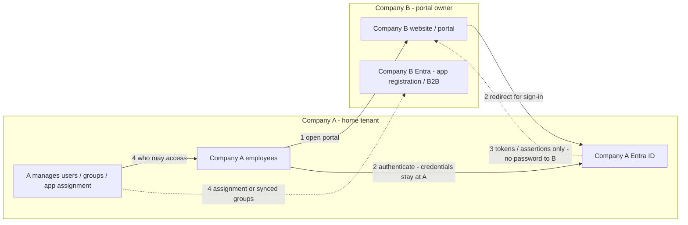
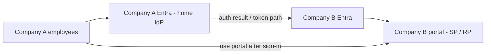
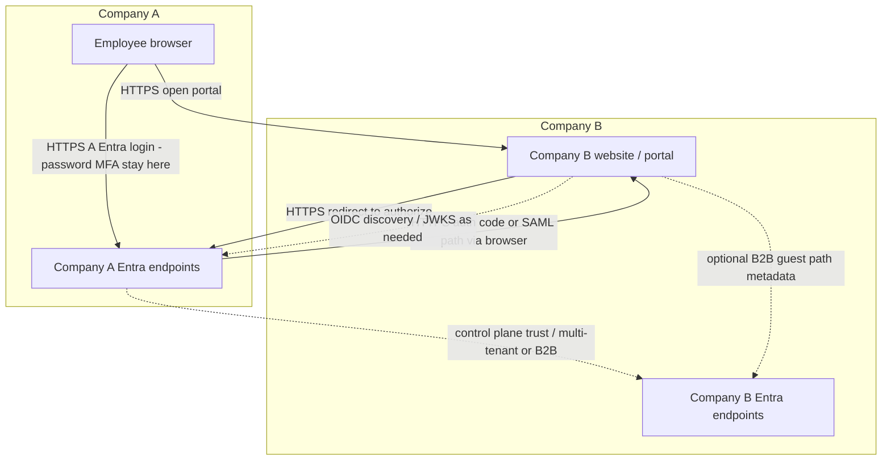

# Cross-federation: your organization → third-party partner portal

In this reference, **Company A = your organization** and **Company B = a third-party partner** (supplier, customer, alliance partner) that **hosts its own portal or application** in **its** Entra tenant — not a commercial SaaS product you subscribe to from a vendor gallery.

## Primary scenario (this reference)

| # | Requirement | Outcome |
|---|---|---|
| 1 | **Company A** employees need access to **Company B** website/portal | Yes |
| 2 | Employees must see the **Company A Entra ID** login page | Yes |
| 3 | Company A **credentials must not pass through** Company B | Yes — password/MFA stay at A |
| 4 | **Company A manages RBAC** for which of its employees can use the portal | Yes — with multi-tenant assignment or A→B group sync (see below) |

**No separate partner-user login.** The only people signing in are **your employees**. They authenticate exclusively at **your Entra**. The partner never presents a login form that collects your passwords.

## Federation vs cross-federation — when to choose this pattern

**Both Browser SSO and cross-federation are federation.** Cross-federation is **not** “use this when the partner can’t do federation.”

| Situation | Pattern | Why |
|---|---|---|
| Your employees need **Salesforce, ServiceNow, Workday**, etc. | [03 — Browser SSO](./03-browser-sso-saml-oidc.md) | Commercial **SaaS vendor** with standard enterprise SSO; you add an enterprise app in **your** tenant |
| Your employees need the **partner’s custom portal** (supplier hub, collaboration site) hosted in **partner’s** tenant | **This doc (05)** | **Tenant-to-tenant** (or multi-tenant app) integration; partner is not a SaaS SKU |
| Partner offers SaaS **and** you need it | **03**, not 05 | If the product supports SAML/OIDC enterprise SSO, federate via **your** enterprise app — even though the partner “can do federation” |
| You need **your** Entra login, credentials never at partner, **you** manage which employees access partner portal | **05** | Organizational and security requirements on top of federation mechanics |

**Choose cross-federation when** the integration is **your workforce → partner’s application estate**, with the four requirements in the table below — not because SAML/OIDC is unavailable.

## Choose this when

- **Your** workforce users must use a **partner-hosted** portal (not a gallery SaaS product)
- Sign-in must happen at **your Entra** (home IdP), not at the partner’s credential store
- **You** must control day-to-day who among your employees is allowed into the partner portal
- You need a trust model between **your** Entra tenant and the **partner’s** application/tenant

## Prefer another pattern when

- The third party is a **commercial SaaS vendor** (standard product + enterprise SSO) → [03 — Browser SSO](./03-browser-sso-saml-oidc.md) — **this is still federation**
- Users and the app are in the **same** Entra tenant → [03](./03-browser-sso-saml-oidc.md) or [04](./04-api-oauth-obo.md)
- On-prem ADFS / Active Directory only → [06 — Legacy ADFS and AD](./06-legacy-adfs-ad.md)
- Company A does **not** use Entra (Okta/Ping/ADFS only) → see [Alternate: non-Entra home IdP](#alternate-non-entra-home-idp-for-company-a) below

## How the four requirements are met



| Requirement | Mechanism |
|---|---|
| **1. Access B’s portal** | Portal is an Entra-integrated app (OIDC RP or SAML SP) that Company A’s employees can reach |
| **2. A’s Entra login page** | Sign-in is routed to **Tenant A** (multi-tenant home-tenant auth, or B2B redirect to home Entra). Users never enter passwords on B’s UI |
| **3. Credentials never through B** | Browser redirects to `login.microsoftonline.com` for **A**. B receives only post-auth **tokens/assertions** (and optional authorization codes). Secrets stay with A |
| **4. A manages RBAC** | Prefer **Pattern 1** (multi-tenant app + assignment in A). Or **Pattern 2** (B2B + cross-tenant sync of A’s groups into B, with one-time app assignment in B) |

Landscape diagrams: [02 — Components and network topology](./02-components-and-topology.md#cross-federation-company-a--company-b).

## Components and network topology

### High-level components



- **Company A Entra:** authenticates employees; holds passwords/MFA; A admins assign users/groups (Pattern 1) or manage groups that sync to B (Pattern 2)
- **Company B Entra:** hosts the app registration / enterprise app and (for B2B) guest or synced identities; does **not** collect A credentials
- **Company B portal:** trusts Entra-issued identity for the signed-in user; implements app sessions as in [03](./03-browser-sso-saml-oidc.md)

### Network topology (logical)



**Credential boundary:** the only place Company A passwords and MFA secrets are entered is **Company A’s Entra**. Company B’s portal and Tenant B see redirects and tokens — not A’s credentials.

## Patterns that satisfy requirement 4 (A-managed RBAC)

### Pattern 1 — Multi-tenant app (recommended when A must own assignment)

1. Company B registers the portal as a **multi-tenant** Entra application  
2. Company A admin **consents** the app into Tenant A (once)  
3. Company A assigns **users/groups in Tenant A** to that enterprise app  
4. Employees open B’s portal → authenticate at **A’s Entra** → portal session established  

**RBAC:** day-to-day “who can use the portal” is managed entirely in **Company A**. Company B owns the application code and optional app-role *definitions*; A owns *who is assigned*.

### Pattern 2 — B2B into B + cross-tenant sync (A owns group membership)

1. Company B hosts a **single-tenant** (or B2B-capable) enterprise app  
2. Company A employees appear in Tenant B as **guests** or **synced external members**  
3. **Cross-tenant synchronization** (A → B): A manages security groups in **A**; membership syncs into **B**  
4. Company B performs a **one-time** assignment of the synced group to the portal  
5. Sign-in still redirects to **Company A Entra** (credentials stay at A)  

**RBAC:** A manages join/leave via groups in A. B does not need to edit assignment for every hire/leave.

### What does *not* meet requirement 4

Classic **single-tenant app in B + B2B guests** with **no** multi-tenant consent and **no** A→B group sync: A owns login (requirements 1–3), but **B** must assign each guest/group in B’s directory. That fails requirement 4.

## Sequence: Company A employee → Company B portal

Primary happy path for **Pattern 1 (multi-tenant)** — login page is Company A Entra; no partner/guest credential prompt:

```mermaid
sequenceDiagram
  actor Employee as "Company A employee"
  participant Browser
  participant Portal as "Company B portal"
  participant AEntra as "Company A Entra"
  participant BEntra as "Company B Entra"

  Employee->>Browser: Open Company B portal
  Browser->>Portal: GET protected resource
  Portal->>Browser: Redirect to authorize (multi-tenant / home tenant A)
  Browser->>AEntra: Company A Entra login page
  Note over Browser,AEntra: Password and MFA stay at Company A - never posted to B
  Employee->>AEntra: Authenticate
  AEntra->>Browser: Auth success (code or tokens per protocol)
  Browser->>Portal: Complete sign-in (OIDC code or SAML ACS)
  Portal->>Portal: Validate token/assertion; create app session
  Note over AEntra,BEntra: A already assigned user/group to app in Tenant A
  Portal->>Browser: Signed-in session
```

For **Pattern 2 (B2B)**, the browser may briefly touch Company B’s Entra to start guest/B2B routing, then redirects to **Company A Entra** for the actual login page. Credentials still never enter Company B’s application.

## Key configurations

See also [07 — Key configurations](./07-key-configurations.md).

**Company A (home — owns login + RBAC):**

- Tenant / issuer for employee sign-in  
- User and group lifecycle for employees allowed to use B’s portal  
- **Pattern 1:** admin consent to B’s multi-tenant app; **user/group assignment** on the enterprise app in A  
- **Pattern 2:** groups (and sync configuration) that drive who appears in B; MFA/Conditional Access for A’s workforce  

**Company B (portal owner — does not collect A credentials):**

- App registration / enterprise app for the portal (multi-tenant for Pattern 1, or single-tenant + B2B for Pattern 2)  
- Redirect URIs / ACS, logout URL, outbound claims the portal needs  
- **Pattern 2:** B2B / cross-tenant access settings; one-time assignment of **synced** A groups to the portal  
- Conditional Access on B’s side if required (may trust A’s MFA claims via cross-tenant access)  

**Both:**

- TLS everywhere; validate redirect/ACS URLs  
- No expectation that A passwords traverse B’s portal or B’s custom login UI  

## Common pitfalls

- **Assuming B2B alone puts RBAC under A** — without multi-tenant assignment or A→B sync, B owns who can open the portal  
- **Building a login form on B’s portal for A users** — breaks requirements 2 and 3; always redirect to A’s Entra  
- **SAML federation between two Entra tenants** for this scenario — prefer native multi-tenant or B2B/cross-tenant; do not invent Entra↔Entra SAML as the default  
- **Verifying A’s email domain in Tenant B** to “force” federation — usually wrong for Entra↔Entra; use multi-tenant or B2B routing instead  
- **Expecting A’s Azure RBAC to grant access inside B’s Azure subscriptions** — Azure RBAC in B’s cloud is still assigned in B (often onto synced groups from A)  

## Alternate: non-Entra home IdP for Company A

If Company A uses **Okta, Ping, or ADFS** (not Entra) while Company B’s portal is on Entra, use **B2B with a federated SAML/WS-Fed IdP** so A employees still authenticate at A’s IdP and credentials stay at A. Day-to-day RBAC for “who may access B’s portal” then typically needs group sync, entitlement packages, or assignment processes agreed between A and B — it is **not** the same as Pattern 1 multi-tenant assignment in Entra A. Protocol details (metadata, issuer, NameID/ImmutableID) are in [07](./07-key-configurations.md) and older workforce federation notes; this primary scenario assumes **both orgs use Entra**.

## Related

- [01 — Enterprise SSO landscape](./01-sso-landscape.md)
- [02 — Components and network topology](./02-components-and-topology.md#cross-federation-company-a--company-b)
- [03 — Browser SSO (SAML / OIDC)](./03-browser-sso-saml-oidc.md)
- [04 — API OAuth and OBO](./04-api-oauth-obo.md)
- [06 — Legacy ADFS and AD](./06-legacy-adfs-ad.md)
- [07 — Key configurations](./07-key-configurations.md)
- [Glossary](./glossary.md)
