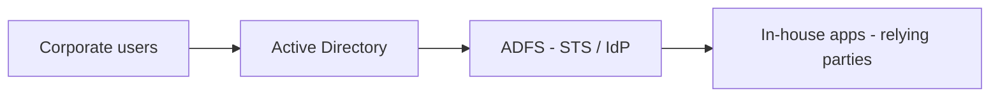
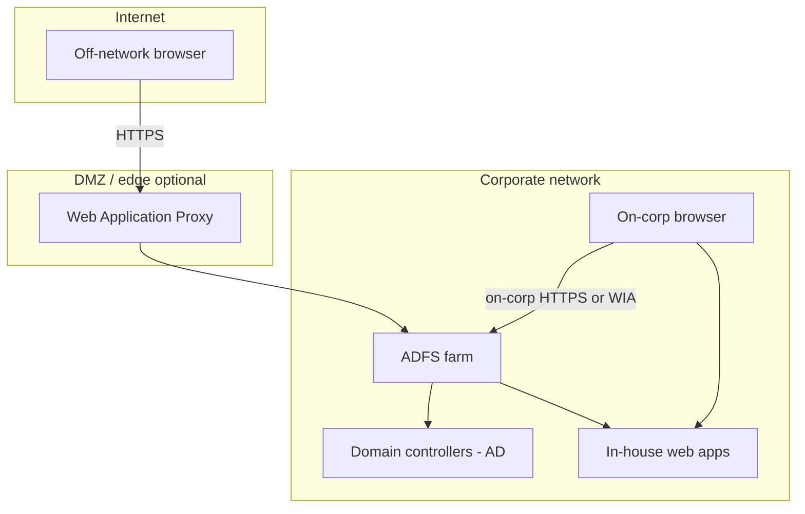
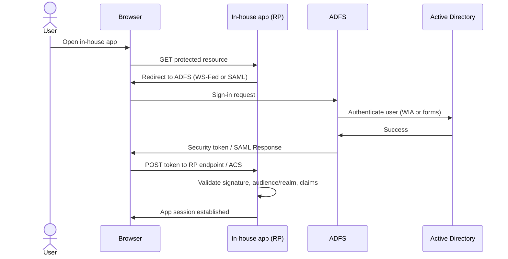
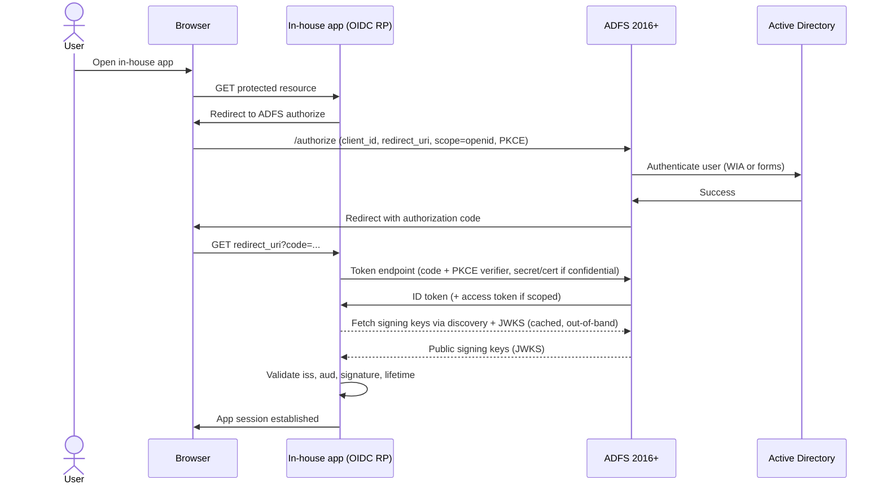

# Legacy SSO: ADFS and Active Directory

## Choose this when

- **In-house applications** are already integrated with **ADFS** as the federation authority
- The authoritative **identity store is on-premises Active Directory** — user accounts, groups, and password policy live in AD domain controllers
- **WS-Federation, SAML 2.0, or (ADFS 2016+) OIDC** application trusts already exist between ADFS and your corporate web apps
- Users and apps remain **corp-network-centric** — sign-in traffic stays on the legacy identity plane (see diagrams below and the landscape view in [02](./02-components-and-topology.md))

## Prefer another pattern when

- **New cloud or SaaS integrations** — register the app in **Entra ID** and use SAML 2.0 or OIDC browser SSO → [03 — Browser SSO (SAML / OIDC)](./03-browser-sso-saml-oidc.md)
- **Modern web, SPA, or API workloads** needing rich OAuth (client credentials, On-Behalf-Of, Entra-centric token pipelines) — prefer Entra → [04 — API OAuth and OBO](./04-api-oauth-obo.md). ADFS 2016+ can issue OIDC/OAuth tokens for in-house apps that must stay on ADFS, but Entra remains the better default for new OAuth work
- **Partner-organization users** authenticating at their home IdP (Okta, Ping, partner Entra) to access your apps → [05 — Cross-federation](./05-cross-federation.md)
- **Greenfield projects** with no existing ADFS trust — prefer Entra as the IdP even when AD remains the directory source via hybrid sync

## Actors

| Actor | Role |
|---|---|
| User | Corporate employee accessing an in-house application |
| Browser | User agent that follows redirects and POSTs federation tokens |
| In-house app (relying party) | Protected web application that trusts ADFS-issued tokens (WS-Fed / SAML / OIDC) and establishes its own session |
| ADFS (STS / IdP / AS) | On-premises federation service that authenticates users against AD and issues WS-Fed, SAML, or (2016+) OIDC/OAuth tokens |
| Active Directory | Authoritative on-prem directory — domain controllers validate credentials and supply attributes |
| Web Application Proxy (optional) | Edge reverse proxy that publishes ADFS endpoints to the internet without exposing the farm directly |

## Components and network topology

Focused views for **legacy ADFS + Active Directory** in-house SSO. Landscape-wide diagrams (with Entra and partners) live in [02](./02-components-and-topology.md).

### High-level components

### Network topology (logical)

On-corp users often hit ADFS directly (WIA or forms); off-network users typically reach ADFS through **WAP** in a DMZ. Token-signing trust and federation metadata remain control-plane between ADFS and the relying party.

## Protocols

ADFS supports three browser federation / identity protocols for in-house apps:

| Protocol | Typical ADFS use | Notes |
|---|---|---|
| **WS-Federation** | Legacy .NET and SharePoint workloads | Passive redirects and form posts of a security token |
| **SAML 2.0** | Apps or vendors that expect SAML SP semantics | Browser POST of a signed assertion to the ACS |
| **OpenID Connect / OAuth 2.0** | Modern in-house web apps on **ADFS 2016+** | Authorization code (+ ID token / access token); discovery and JWKS like Entra OIDC |

WS-Fed and SAML achieve the same outcome: the user authenticates at ADFS and the relying party receives a signed token or assertion to create an application session. **OIDC on ADFS** is the same *style* of flow as Entra OIDC ([03](./03-browser-sso-saml-oidc.md)) — authorize → code → token endpoint — but the issuer, discovery document, and JWKS are the **ADFS farm**, not `login.microsoftonline.com`. Prefer Entra OIDC for new cloud-facing work; use ADFS OIDC when the app and identity plane must remain on-prem ADFS.

**Authentication to ADFS** (distinct from federation to the app) typically uses **Windows Integrated Authentication (WIA)** on corp-network browsers — the browser negotiates with AD via Kerberos/NTLM without a separate login form — or **forms-based authentication** when the user is off-network or WIA is unavailable. WIA is mentioned here only as the corp-network default; Kerberos internals are out of scope for this reference.

## Example: in-house web app (WS-Fed / SAML)

An in-house application registers as a **relying party trust** on the ADFS farm. The trust defines:

- **Identifier / realm** — the URI the app expects as audience (WS-Fed `wtrealm` or SAML `Audience`); must match exactly on both sides
- **Endpoints** — WS-Fed passive sign-in endpoint or SAML ACS URL where the browser POSTs the token
- **Issuance transform rules** — claim rules that map AD attributes (UPN, email, display name, group SIDs) into outbound claims the app consumes
- **Token-signing certificate** — the app trusts tokens signed by ADFS's token-signing cert (from federation metadata); plan rollover before expiry

After successful authentication, the app validates the token signature, issuer, audience/realm, and lifetime, maps claims to a local user profile, and creates its **own session** (cookie or server-side store). Federation tokens prove identity at login; they are not a substitute for the app's session management.

## Example: in-house web app (OIDC on ADFS 2016+)

An in-house application registers as an **application group** / OAuth client on ADFS (not only a classic relying party trust). Configuration defines:

- **Client ID** — application identifier the RP sends on `/authorize` and `/token`
- **Redirect URI** — exact callback URL for the authorization code return (scheme, host, path, trailing slash)
- **Scopes** — at minimum `openid` for an ID token; optional resource scopes if ADFS issues access tokens for APIs the farm protects
- **Client authentication** — confidential clients use a secret or certificate at the token endpoint; public clients use PKCE where supported
- **Discovery / JWKS** — ADFS publishes OIDC discovery (e.g. `https://{adfs-hostname}/adfs/.well-known/openid-configuration`) and a JWKS URI; the app validates JWT signature, `iss`, `aud`, and lifetime from those keys

After the code exchange, the app validates the **ID token**, establishes its own session, and (if applicable) uses any **access token** only for APIs that trust that ADFS issuer. ADFS OAuth is thinner than Entra: do not expect Entra-equivalent OBO or Graph-style app-only pipelines here — for those, prefer [04](./04-api-oauth-obo.md) on Entra.

## Optional bridge note

ADFS can **federate outbound** to cloud IdPs — for example, acting as a claims provider to Entra or issuing tokens to SaaS that trusts ADFS as a SAML IdP. This reference notes the capability for awareness only. It is **not** a migration guide; when building new cloud-facing workloads, prefer Entra as the primary IdP and follow [03](./03-browser-sso-saml-oidc.md) rather than extending ADFS outbound trusts.

## Sequence: ADFS browser SSO (WS-Fed / SAML)

## Sequence: ADFS OIDC (authorization code)

Same outcome as Entra OIDC browser SSO, with ADFS as the authorization server. Use this when the in-house app is an OIDC client registered on ADFS 2016+.

> **Contrast with WS-Fed / SAML on ADFS:** OIDC adds a **runtime token-endpoint call** (app → ADFS) and JWT validation via **discovery/JWKS**. Classic WS-Fed/SAML trusts are metadata + browser POST of the token/assertion — no code exchange step.

## Key configurations

Detailed checklists and ADFS field names live in [07 — Key configurations](./07-key-configurations.md). For legacy ADFS browser SSO, confirm at minimum:

**WS-Fed / SAML**

- **Federation service URL** — the ADFS farm's external or internal hostname; this becomes the token **issuer** that relying parties pin
- **Federation metadata** — ADFS publishes WS-Fed or SAML metadata (endpoints, signing certificates); apps import metadata rather than hand-copying URLs
- **Relying party identifier / realm** — exact match between the trust configuration and what the app validates as audience
- **Endpoints** — passive sign-in URL (WS-Fed) or ACS URL (SAML); scheme, host, path, and trailing slash must match
- **Issuance transform rules** — AD attribute store claims mapped to outbound claim types the app expects (UPN, email, roles, groups)
- **Token-signing certificate** — current signing cert in metadata; schedule rollover and update all relying parties before expiry

**OIDC (ADFS 2016+)**

- **OIDC discovery URL** — `https://{adfs-hostname}/adfs/.well-known/openid-configuration` (issuer, authorize, token, JWKS)
- **Client ID** — application group / OAuth client identifier
- **Redirect URI** — exact callback registered on ADFS and validated by the RP
- **Scopes** — `openid` (and resource scopes if access tokens are used)
- **Client authentication / PKCE** — confidential client secret or cert, or public-client PKCE as configured
- **JWKS validation** — app caches ADFS public keys and verifies JWT signatures locally

**Shared**

- **Web Application Proxy (optional)** — if external users need ADFS sign-in, publish through WAP in the DMZ rather than exposing the farm directly to the internet

## Common pitfalls

- **Relying party identifier mismatch** — a one-character difference in realm/audience URI (or OIDC `aud` / client ID) causes silent login failures or "token not intended for this recipient" errors
- **Token-signing certificate rollover** — new cert deployed on ADFS but relying parties still trust the old cert; import updated metadata (or refresh JWKS) before the old cert expires
- **Publishing internal-only ADFS to the internet without WAP** — exposing the farm directly bypasses edge hardening; use Web Application Proxy for external access
- **Confusing AD authentication with ADFS SSO** — AD validates credentials; ADFS issues federation or OIDC tokens. The app never talks to AD directly — it trusts ADFS-signed tokens only
- **Clock skew** — SAML `NotOnOrAfter` and JWT `exp` fail validation if app servers drift from domain time; sync NTP
- **Claim rule gaps** — app expects a claim type (e.g., `emailaddress`) that issuance rules do not emit; verify outbound claims against app requirements before go-live
- **Assuming Entra OAuth parity on ADFS** — ADFS OIDC covers browser sign-in for in-house clients; rich API patterns (OBO, Graph-style app-only) belong on Entra ([04](./04-api-oauth-obo.md))
- **Wrong discovery host** — internal vs WAP-published ADFS hostname must match what the app uses for issuer and JWKS, or token validation fails

## Related

- [01 — Enterprise SSO landscape](./01-sso-landscape.md)
- [02 — Components and network topology](./02-components-and-topology.md)
- [03 — Browser SSO (SAML / OIDC)](./03-browser-sso-saml-oidc.md) — modern Entra alternative
- [04 — API OAuth and OBO](./04-api-oauth-obo.md)
- [05 — Cross-federation](./05-cross-federation.md)
- [07 — Key configurations](./07-key-configurations.md)
- [Glossary](./glossary.md)
