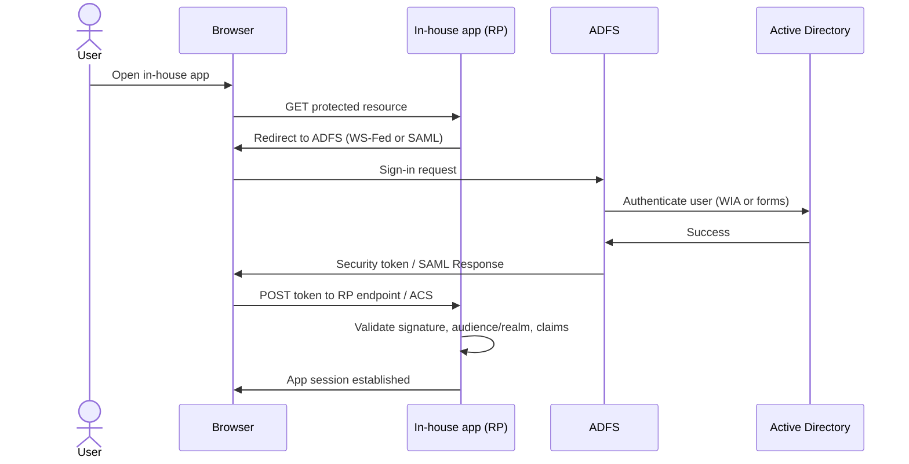

# Legacy SSO: ADFS and Active Directory

## Choose this when

- **In-house applications** are already integrated with **ADFS** as the federation authority
- The authoritative **identity store is on-premises Active Directory** — user accounts, groups, and password policy live in AD domain controllers
- **WS-Federation or SAML 2.0 relying party trusts** already exist between ADFS and your corporate web apps
- Users and apps remain **corp-network-centric** — sign-in traffic stays on the legacy identity plane described in [02 — Components and network topology](./02-components-and-topology.md)

## Prefer another pattern when

- **New cloud or SaaS integrations** — register the app in **Entra ID** and use SAML 2.0 or OIDC browser SSO → [03 — Browser SSO (SAML / OIDC)](./03-browser-sso-saml-oidc.md)
- **Modern web, SPA, or API workloads** needing OAuth access tokens, client credentials, or On-Behalf-Of chains → [04 — API OAuth and OBO](./04-api-oauth-obo.md)
- **Partner-organization users** authenticating at their home IdP (Okta, Ping, partner Entra) to access your apps → [05 — Cross-federation](./05-cross-federation.md)
- **Greenfield projects** with no existing ADFS trust — prefer Entra as the IdP even when AD remains the directory source via hybrid sync

## Actors

| Actor | Role |
|---|---|
| User | Corporate employee accessing an in-house application |
| Browser | User agent that follows redirects and POSTs federation tokens |
| In-house app (relying party) | Protected web application that trusts ADFS-issued tokens and establishes its own session |
| ADFS (STS / IdP) | On-premises federation service that authenticates users against AD and issues WS-Fed or SAML tokens |
| Active Directory | Authoritative on-prem directory — domain controllers validate credentials and supply attributes |
| Web Application Proxy (optional) | Edge reverse proxy that publishes ADFS endpoints to the internet without exposing the farm directly |

## Protocols

ADFS supports **WS-Federation** (common for legacy .NET and SharePoint workloads) and **SAML 2.0** (common when the app or a third-party vendor expects SAML SP semantics). Both achieve the same outcome: the user authenticates at ADFS and the relying party receives a signed token or assertion to create an application session.

**Authentication to ADFS** (distinct from federation to the app) typically uses **Windows Integrated Authentication (WIA)** on corp-network browsers — the browser negotiates with AD via Kerberos/NTLM without a separate login form — or **forms-based authentication** when the user is off-network or WIA is unavailable. WIA is mentioned here only as the corp-network default; Kerberos internals are out of scope for this reference.

## Example: in-house web app

An in-house application registers as a **relying party trust** on the ADFS farm. The trust defines:

- **Identifier / realm** — the URI the app expects as audience (WS-Fed `wtrealm` or SAML `Audience`); must match exactly on both sides
- **Endpoints** — WS-Fed passive sign-in endpoint or SAML ACS URL where the browser POSTs the token
- **Issuance transform rules** — claim rules that map AD attributes (UPN, email, display name, group SIDs) into outbound claims the app consumes
- **Token-signing certificate** — the app trusts tokens signed by ADFS's token-signing cert (from federation metadata); plan rollover before expiry

After successful authentication, the app validates the token signature, issuer, audience/realm, and lifetime, maps claims to a local user profile, and creates its **own session** (cookie or server-side store). Federation tokens prove identity at login; they are not a substitute for the app's session management.

## Optional bridge note

ADFS can **federate outbound** to cloud IdPs — for example, acting as a claims provider to Entra or issuing tokens to SaaS that trusts ADFS as a SAML IdP. This reference notes the capability for awareness only. It is **not** a migration guide; when building new cloud-facing workloads, prefer Entra as the primary IdP and follow [03](./03-browser-sso-saml-oidc.md) rather than extending ADFS outbound trusts.

## Sequence: ADFS browser SSO

## Key configurations

Detailed checklists and ADFS field names live in [07 — Key configurations](./07-key-configurations.md). For legacy ADFS browser SSO, confirm at minimum:

- **Federation service URL** — the ADFS farm's external or internal hostname; this becomes the token **issuer** that relying parties pin
- **Federation metadata** — ADFS publishes WS-Fed or SAML metadata (endpoints, signing certificates); apps import metadata rather than hand-copying URLs
- **Relying party identifier / realm** — exact match between the trust configuration and what the app validates as audience
- **Endpoints** — passive sign-in URL (WS-Fed) or ACS URL (SAML); scheme, host, path, and trailing slash must match
- **Issuance transform rules** — AD attribute store claims mapped to outbound claim types the app expects (UPN, email, roles, groups)
- **Token-signing certificate** — current signing cert in metadata; schedule rollover and update all relying parties before expiry
- **Web Application Proxy (optional)** — if external users need ADFS sign-in, publish through WAP in the DMZ rather than exposing the farm directly to the internet

## Common pitfalls

- **Relying party identifier mismatch** — a one-character difference in realm/audience URI causes silent login failures or "token not intended for this recipient" errors
- **Token-signing certificate rollover** — new cert deployed on ADFS but relying parties still trust the old cert; import updated metadata before the old cert expires
- **Publishing internal-only ADFS to the internet without WAP** — exposing the farm directly bypasses edge hardening; use Web Application Proxy for external access
- **Confusing AD authentication with ADFS SSO** — AD validates credentials; ADFS issues federation tokens. The app never talks to AD directly — it trusts ADFS-signed tokens only
- **Clock skew** — SAML `NotOnOrAfter` and token `exp` fail validation if app servers drift from domain time; sync NTP
- **Claim rule gaps** — app expects a claim type (e.g., `emailaddress`) that issuance rules do not emit; verify outbound claims against app requirements before go-live

## Related

- [01 — Enterprise SSO landscape](./01-sso-landscape.md)
- [02 — Components and network topology](./02-components-and-topology.md)
- [03 — Browser SSO (SAML / OIDC)](./03-browser-sso-saml-oidc.md) — modern Entra alternative
- [04 — API OAuth and OBO](./04-api-oauth-obo.md)
- [05 — Cross-federation](./05-cross-federation.md)
- [07 — Key configurations](./07-key-configurations.md)
- [Glossary](./glossary.md)
