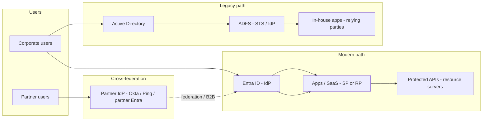
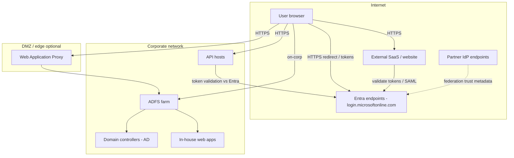
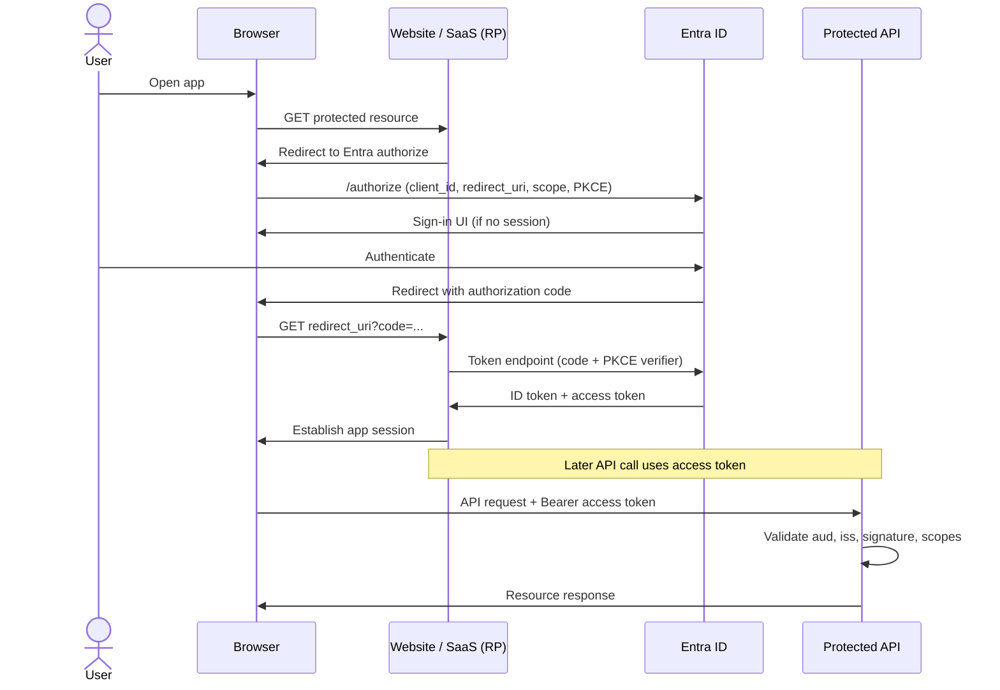
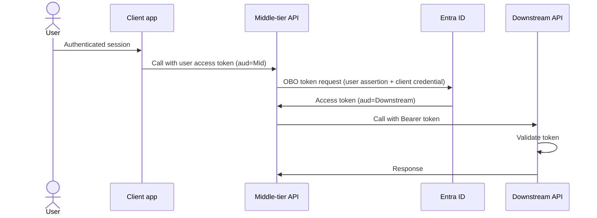
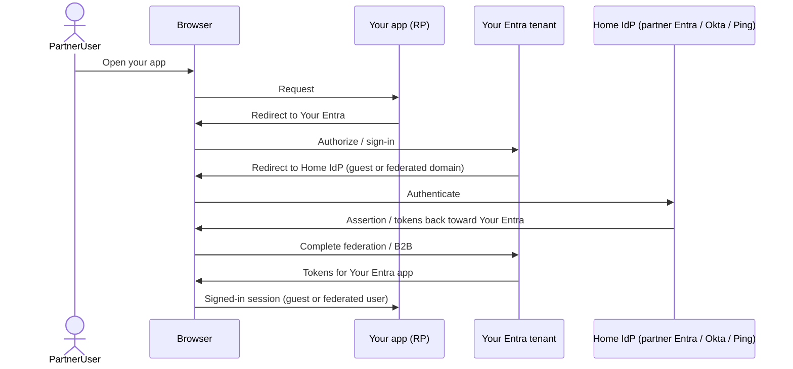
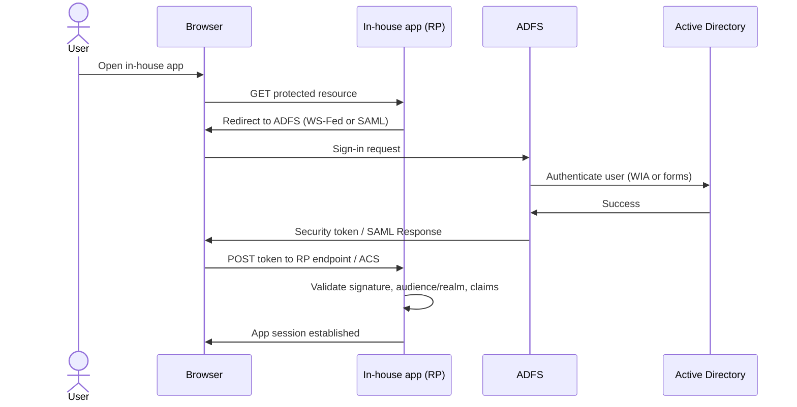

# Enterprise SSO Reference Documentation Implementation Plan

> **For agentic workers:** REQUIRED SUB-SKILL: Use superpowers:subagent-driven-development (recommended) or superpowers:executing-plans to implement this plan task-by-task. Steps use checkbox (`- [ ]`) syntax for tracking.

**Goal:** Author a decision-reference markdown set under `docs/` so architects and engineers can map SSO requirements to protocols, Entra patterns, cross-federation, and legacy ADFS/AD—with Mermaid diagrams and key-config checklists only.

**Architecture:** Pattern-first docs (landscape → topology → browser SSO → APIs → federation → legacy ADFS → consolidated configs), plus glossary and README reading paths. Spec: `docs/superpowers/specs/2026-07-15-enterprise-sso-reference-design.md`.

**Tech Stack:** GitHub-flavored Markdown, Mermaid diagrams, relative markdown links. No application code, SDKs, or portal screenshots.

## Global Constraints

- Tone: conceptual + diagrams + **key configurations only** (no portal/console click-paths, no SDK/code samples).
- Dual audience: architects and developers; every pattern doc has **Choose this when** / **Prefer another when**, actors, protocol, diagram pointer, key configs, common pitfalls.
- Entra ID is the primary *modern* IdP example; ADFS + Active Directory is a first-class *legacy* pattern for in-house apps.
- Cross-federation in scope: B2B guests; inbound IdP federation to Okta/Ping **or another org’s Entra tenant**.
- Out of scope: CIAM deep-dive, CA/MFA product guide (flag only), Kerberos internals, full ADFS→Entra migration runbook, demo apps.
- No `TBD` / `TODO` / placeholder sections in shipped docs.
- Mermaid must be valid for GitHub-flavored Markdown viewers.
- File set locked to the structure below; do not add extra pattern docs.

## File Structure

| File | Responsibility |
|---|---|
| `docs/glossary.md` | Shared terms (IdP, SP/RP, ADFS, claims, issuer, etc.) |
| `docs/01-sso-landscape.md` | Protocol map + full decision table |
| `docs/02-components-and-topology.md` | Component + network topology Mermaid (Entra + ADFS paths) |
| `docs/03-browser-sso-saml-oidc.md` | Browser SaaS/website SSO via Entra; OIDC sequence (+ SAML note) |
| `docs/04-api-oauth-obo.md` | API patterns: delegated, app-only, OBO |
| `docs/05-cross-federation.md` | B2B + IdP federation; federation sequence |
| `docs/06-legacy-adfs-ad.md` | ADFS + AD for in-house apps; ADFS sequence |
| `docs/07-key-configurations.md` | Consolidated Entra + ADFS checklists |
| `docs/README.md` | Entry point, reading paths, jump to decision table |

---

### Task 1: Glossary

**Files:**
- Create: `docs/glossary.md`

**Interfaces:**
- Consumes: none
- Produces: Canonical definitions linked from all other docs: IdP, SP, RP, STS, tenant, issuer, claims, assertion, access/ID/refresh token, audience, scope, ACS, redirect URI, B2B guest, federation metadata, relying party trust, ADFS, WAP, OBO, WS-Federation

- [ ] **Step 1: Create `docs/glossary.md` with these exact term headings (alphabetical)**

Write the file with a short intro (“Terms used across this SSO reference”) and one `###` heading per term below. Each definition: 1–3 sentences, decision-oriented, no portal steps.

Required terms:
- Access token
- ACS (Assertion Consumer Service)
- Active Directory (AD)
- ADFS (Active Directory Federation Services)
- Audience (`aud`)
- B2B guest user
- Claim / assertion
- Client credentials
- Federation metadata
- ID token
- IdP (Identity Provider)
- Issuer
- OAuth 2.0
- OIDC (OpenID Connect)
- OBO (On-Behalf-Of)
- Redirect URI
- Relying party (WS-Fed) / Relying party trust
- RP (Relying Party / OIDC)
- SAML 2.0
- Scope
- SP (Service Provider)
- STS (Security Token Service)
- Tenant (Entra)
- Token-signing certificate
- WAP (Web Application Proxy)
- WS-Federation (WS-Fed)
- WIA (Windows Integrated Authentication) — one sentence: how users may authenticate *to* ADFS on corp network; no Kerberos deep-dive

Include a one-line note under SP and RP: SAML uses **SP**; OIDC uses **RP**; WS-Fed uses **relying party** — same role, different protocol vocabulary.

- [ ] **Step 2: Verify glossary completeness**

Run:

```bash
for t in "Access token" "ACS" "Active Directory" "ADFS" "Audience" "B2B guest" "Claim" "Client credentials" "Federation metadata" "ID token" "IdP" "Issuer" "OAuth 2.0" "OIDC" "OBO" "Redirect URI" "Relying party" "RP" "SAML 2.0" "Scope" "SP" "STS" "Tenant" "Token-signing" "WAP" "WS-Federation" "WIA"; do
  grep -q "$t" docs/glossary.md || echo "MISSING: $t"
done
grep -E 'TBD|TODO|FIXME' docs/glossary.md && echo 'FAIL placeholders' || echo 'OK no placeholders'
```

Expected: no `MISSING:` lines; `OK no placeholders`

- [ ] **Step 3: Commit**

```bash
git add docs/glossary.md
git commit -m "$(cat <<'EOF'
Add SSO reference glossary for shared IdP terminology.

EOF
)"
```

---

### Task 2: SSO landscape and decision table

**Files:**
- Create: `docs/01-sso-landscape.md`

**Interfaces:**
- Consumes: term names from `docs/glossary.md`
- Produces: Decision table rows (six patterns) and protocol map that README and pattern docs link to

- [ ] **Step 1: Create `docs/01-sso-landscape.md`**

Required sections (use these headings):

1. `# Enterprise SSO landscape`
2. `## Who this is for` — one short paragraph (architects + developers; decision reference)
3. `## Protocol map` — table:

| Protocol | Typical use | Token / assertion style | Notes |
|---|---|---|---|
| SAML 2.0 | Browser SSO to SaaS / enterprise apps | XML assertion | Common with Entra enterprise apps and ADFS |
| WS-Federation | Legacy browser SSO (esp. ADFS / .NET) | Security token via WS-Fed | Prefer OIDC for new cloud apps |
| OpenID Connect | Modern browser / SPA sign-in | ID token (+ often access token) | Built on OAuth 2.0 |
| OAuth 2.0 | API authorization | Access (and refresh) tokens | Not “SSO” alone; pairs with OIDC for user login |
| OAuth OBO | API → API with user context | New access token for downstream API | Entra-specific extension pattern |

4. `## Decision table` — exact six rows from the design spec:

| Requirement signal | Likely pattern | Primary protocol(s) | Jump to |
|---|---|---|---|
| Browser login to SaaS / partner site | Browser SSO (Entra) | SAML 2.0 or OIDC | [03](./03-browser-sso-saml-oidc.md) |
| Modern web/SPA calling your APIs | OIDC + OAuth | Auth code (+ PKCE), tokens to API | [03](./03-browser-sso-saml-oidc.md), [04](./04-api-oauth-obo.md) |
| Service/daemon calling APIs (no user) | App-only | Client credentials | [04](./04-api-oauth-obo.md) |
| API needs user context via another API | Delegated chain | OAuth On-Behalf-Of (OBO) | [04](./04-api-oauth-obo.md) |
| Users from partner org (their IdP or Entra) | Cross-federation | B2B + SAML/OIDC federation | [05](./05-cross-federation.md) |
| In-house app SSO against on-prem AD (legacy) | ADFS + Active Directory | WS-Fed and/or SAML 2.0 | [06](./06-legacy-adfs-ad.md) |

5. `## Pattern catalog (summary)` — six bullets, one sentence each, linking to 03–06 and pointing to [02](./02-components-and-topology.md) for diagrams and [07](./07-key-configurations.md) for configs
6. `## Terminology` — link to [glossary](./glossary.md); restate SP ↔ RP ↔ relying party once
7. `## What this reference deliberately skips` — bullet the non-goals from the spec (short)

- [ ] **Step 2: Verify decision table and links**

Run:

```bash
test -f docs/01-sso-landscape.md
grep -c 'Jump to' docs/01-sso-landscape.md
grep -E '03-browser|04-api|05-cross|06-legacy' docs/01-sso-landscape.md | wc -l
grep -E 'TBD|TODO|FIXME' docs/01-sso-landscape.md && echo 'FAIL' || echo 'OK'
```

Expected: file exists; decision table present; at least one link mention each to 03–06; `OK`

- [ ] **Step 3: Commit**

```bash
git add docs/01-sso-landscape.md
git commit -m "$(cat <<'EOF'
Add SSO landscape, protocol map, and decision table.

EOF
)"
```

---

### Task 3: Component and network topology diagrams

**Files:**
- Create: `docs/02-components-and-topology.md`

**Interfaces:**
- Consumes: pattern names from `01-sso-landscape.md`
- Produces: Component + topology Mermaid used as diagram pointers from later docs

- [ ] **Step 1: Create `docs/02-components-and-topology.md` with both Mermaid diagrams**

Required headings:
- `# Components and network topology`
- `## High-level components`
- Short prose: modern Entra path vs legacy ADFS path; partner federation side path
- Embed this component diagram (may adjust layout if needed; keep all named actors):

````markdown

````

- `## Network topology (logical)`
- Short prose: TLS everywhere on the wire; redirects cross trust boundaries; federation metadata is control-plane; tokens should not be forwarded unnecessarily
- Embed topology diagram:

````markdown

````

- `## How to use these diagrams` — architects use in stakeholder reviews; developers map their app to SP/RP/API boxes
- `## Related` — links to 03, 05, 06, 01, glossary

- [ ] **Step 2: Verify Mermaid fences and actors**

Run:

```bash
grep -c '```mermaid' docs/02-components-and-topology.md
grep -E 'Entra|ADFS|Active Directory|Partner' docs/02-components-and-topology.md | head -20
grep -E 'TBD|TODO|FIXME' docs/02-components-and-topology.md && echo 'FAIL' || echo 'OK'
```

Expected: at least `2` mermaid fences; Entra and ADFS present; `OK`

- [ ] **Step 3: Commit**

```bash
git add docs/02-components-and-topology.md
git commit -m "$(cat <<'EOF'
Add SSO component and network topology Mermaid diagrams.

EOF
)"
```

---

### Task 4: Browser SSO (SAML / OIDC via Entra)

**Files:**
- Create: `docs/03-browser-sso-saml-oidc.md`

**Interfaces:**
- Consumes: decision row “Browser login…” from 01; diagrams in 02
- Produces: OIDC sequence diagram; SAML callout; pattern for SaaS/website + pointer into API token use

- [ ] **Step 1: Create `docs/03-browser-sso-saml-oidc.md`**

Required structure:

```markdown
# Browser SSO with Entra ID (SAML and OIDC)

## Choose this when
- ...
## Prefer another pattern when
- APIs only / no browser → 04
- Partner users need home-IdP auth → 05
- In-house ADFS-only stack → 06

## Actors
| Actor | Role |
| User browser | ... |
| Entra ID | IdP |
| External website / SaaS | SP (SAML) or RP (OIDC) |
| Optional API | Resource server (see 04) |

## Protocols
- Prefer **OIDC** for modern apps; **SAML 2.0** when the SaaS vendor requires it
- Brief comparison table (3–5 rows): metadata, assertion vs tokens, ACS vs redirect URI

## Example: external website / SaaS via Entra
Conceptual narrative only (enterprise app registration concept, reply URLs, claims). No portal clicks.

## Sequence: OIDC authorization code (then API)
```

Embed:

````markdown

````

Then:

- `## SAML SP-initiated (short)` — 5–8 bullets or a small secondary sequence: App → Entra SSO → SAML Response to ACS → app session. State clearly: same SSO outcome, XML assertion instead of OIDC tokens.
- `## Key configurations` — bullet list pointing to details in [07](./07-key-configurations.md): tenant/issuer, client/app ID, redirect or ACS, logout URL, claims (UPN/email/groups), signing cert for SAML
- `## Common pitfalls` — wrong reply URL; clock skew; missing `openid` scope; confusing ID token vs access token for APIs; group overage
- `## Related` — 02, 04, 05, 07, glossary

- [ ] **Step 2: Verify**

```bash
grep -q 'Choose this when' docs/03-browser-sso-saml-oidc.md
grep -q '```mermaid' docs/03-browser-sso-saml-oidc.md
grep -q 'Common pitfalls' docs/03-browser-sso-saml-oidc.md
grep -E 'TBD|TODO|FIXME' docs/03-browser-sso-saml-oidc.md && echo 'FAIL' || echo 'OK'
```

Expected: all greps succeed; `OK`

- [ ] **Step 3: Commit**

```bash
git add docs/03-browser-sso-saml-oidc.md
git commit -m "$(cat <<'EOF'
Add Entra browser SSO reference for SAML and OIDC.

EOF
)"
```

---

### Task 5: API access (OAuth and OBO)

**Files:**
- Create: `docs/04-api-oauth-obo.md`

**Interfaces:**
- Consumes: browser SSO session/tokens concept from 03
- Produces: Three API patterns (delegated, app-only, OBO) with choose-when guidance

- [ ] **Step 1: Create `docs/04-api-oauth-obo.md`**

Required structure:

- `# API access with Entra ID (OAuth 2.0 and OBO)`
- `## Choose this when` / `## Prefer another pattern when`
- `## Actors` — client app, Entra, API (resource), optional middle-tier for OBO
- `## Pattern A — Delegated user access (web/SPA → API)`  
  - When; auth code + PKCE; access token `aud` = API; scopes  
  - Key configs: Application ID URI, scopes, authorized client apps, audience validation  
- `## Pattern B — App-only (daemon / service)`  
  - Client credentials; `.default` or app roles; no user  
- `## Pattern C — On-Behalf-Of (API → API with user)`  
  - Middle-tier exchanges user token for downstream token  
  - Short Mermaid sequence:

````markdown

````

- `## Key configurations` — pointer to 07; list scopes, app roles, OBO permission on middle tier
- `## Common pitfalls` — wrong `aud`; using ID token as API bearer; missing OBO permission; confusing app-only with delegated
- `## Related` — 03, 05, 07, glossary

- [ ] **Step 2: Verify**

```bash
grep -E 'Pattern A|Pattern B|Pattern C|OBO|Client credentials' docs/04-api-oauth-obo.md
grep -q '```mermaid' docs/04-api-oauth-obo.md
grep -E 'TBD|TODO|FIXME' docs/04-api-oauth-obo.md && echo 'FAIL' || echo 'OK'
```

Expected: all three patterns present; mermaid present; `OK`

- [ ] **Step 3: Commit**

```bash
git add docs/04-api-oauth-obo.md
git commit -m "$(cat <<'EOF'
Add Entra API OAuth and OBO pattern reference.

EOF
)"
```

---

### Task 6: Cross-federation

**Files:**
- Create: `docs/05-cross-federation.md`

**Interfaces:**
- Consumes: Entra as resource-tenant IdP from 02/03
- Produces: B2B vs inbound IdP federation decision guidance + sequence diagram

- [ ] **Step 1: Create `docs/05-cross-federation.md`**

Required structure:

- `# Cross-federation and external identities`
- `## Choose this when` — users belong to another org; need home-IdP auth; partner Entra or Okta/Ping
- `## Prefer another pattern when` — all users are members of your tenant only → 03/04; pure on-prem ADFS internal → 06
- `## Where cross-federation sits` — prose + link to component diagram in 02
- `## Option A — Entra B2B guest users`  
  - Partner user invited/redeemed as guest; authenticates at home tenant (often partner Entra); accesses your apps as guest  
  - Entra↔Entra called out explicitly as common case  
- `## Option B — Inbound IdP federation (SAML/OIDC)`  
  - Your Entra trusts partner Okta, Ping, **or another org’s Entra** via federation settings / custom IdP  
  - Domain federation / issuer URI / metadata concepts at key-config level only  
- `## B2B vs federated IdP (decision)` — short comparison table (lifecycle, UX, who manages credentials, typical use)
- `## Sequence: partner user into your Entra app`

````markdown

````

- `## Key configurations` — metadata URL, issuer, domain, claim mapping expectations; guest vs member; link 07
- `## Common pitfalls` — treating guests like members for licensing/CA; issuer mismatch; missing claim transforms; assuming B2B equals inbound federation
- `## Related` — 02, 03, 07, glossary

- [ ] **Step 2: Verify**

```bash
grep -E 'B2B|Okta|Ping|partner Entra|federat' docs/05-cross-federation.md
grep -q '```mermaid' docs/05-cross-federation.md
grep -E 'TBD|TODO|FIXME' docs/05-cross-federation.md && echo 'FAIL' || echo 'OK'
```

Expected: B2B and partner Entra/Okta/Ping mentioned; mermaid present; `OK`

- [ ] **Step 3: Commit**

```bash
git add docs/05-cross-federation.md
git commit -m "$(cat <<'EOF'
Add cross-federation reference for B2B and inbound IdPs.

EOF
)"
```

---

### Task 7: Legacy ADFS + Active Directory

**Files:**
- Create: `docs/06-legacy-adfs-ad.md`

**Interfaces:**
- Consumes: legacy path from 02; decision row from 01
- Produces: ADFS pattern for in-house apps; retain vs prefer Entra guidance

- [ ] **Step 1: Create `docs/06-legacy-adfs-ad.md`**

Required structure:

- `# Legacy SSO: ADFS and Active Directory`
- `## Choose this when` — in-house apps already integrated with ADFS; identity store is on-prem AD; WS-Fed/SAML RP trusts exist
- `## Prefer another pattern when` — new cloud/SaaS or modern API work → prefer Entra (03/04); partner cloud identities → 05
- `## Actors` — User, Browser, In-house app (relying party), ADFS (STS/IdP), Active Directory, optional WAP
- `## Protocols` — WS-Federation and/or SAML 2.0; WIA vs forms as *auth to ADFS* (one paragraph, no Kerberos deep-dive)
- `## Example: in-house web app` — RP trust concept; identifier/realm; issuance transform claims; app trusts token-signing cert
- `## Optional bridge note` — ADFS may federate outbound to Entra/SaaS; mention only for awareness; not a migration guide
- `## Sequence: ADFS browser SSO`

````markdown

````

- `## Key configurations` — farm/service URL; federation metadata; RP identifier; endpoints; issuance rules; token-signing cert; optional WAP; link 07
- `## Common pitfalls` — RP identifier mismatch; cert rollover; publishing internal-only ADFS to internet without WAP; confusing AD auth with ADFS SSO
- `## Related` — 01, 02, 03 (modern alternative), 07, glossary

- [ ] **Step 2: Verify**

```bash
grep -E 'Choose this when|Prefer another|ADFS|WS-Fed|WAP' docs/06-legacy-adfs-ad.md
grep -q '```mermaid' docs/06-legacy-adfs-ad.md
grep -Ei 'migration runbook|step-by-step|click' docs/06-legacy-adfs-ad.md && echo 'UNEXPECTED deep how-to' || echo 'OK depth'
grep -E 'TBD|TODO|FIXME' docs/06-legacy-adfs-ad.md && echo 'FAIL' || echo 'OK'
```

Expected: sections present; mermaid present; `OK depth`; `OK`

- [ ] **Step 3: Commit**

```bash
git add docs/06-legacy-adfs-ad.md
git commit -m "$(cat <<'EOF'
Add legacy ADFS and Active Directory SSO reference.

EOF
)"
```

---

### Task 8: Consolidated key configurations

**Files:**
- Create: `docs/07-key-configurations.md`

**Interfaces:**
- Consumes: key-config bullets from tasks 4–7
- Produces: Single checklist page pattern docs point to

- [ ] **Step 1: Create `docs/07-key-configurations.md`**

Required structure:

- `# Key configurations to enable SSO`
- Intro: checklists of **what must be known/configured**, not how to click in portals
- `## Entra ID — browser app (OIDC or SAML)`  
  Checklist: tenant/issuer URL; app/client ID; redirect URIs or ACS URL; logout URL; protocol choice; client auth or SAML signing cert; required claims; group→role strategy (high level); CA/MFA as requirement flag
- `## Entra ID — API / OAuth`  
  Application ID URI; scopes; authorized client applications; app roles / `.default`; audience validation rules; OBO: middle-tier permission to call downstream
- `## Entra ID — cross-federation`  
  IdP metadata URL; issuer URI; domain federation expectations; claim transformation expectations; guest vs member implications
- `## ADFS / Active Directory — in-house RP`  
  ADFS service URL; federation metadata URL; RP trust identifier (realm); WS-Fed/SAML endpoints; issuance transform rules; token-signing certificate trust on app; WIA vs forms assumption; optional WAP
- `## Requirement flags (not full guides)`  
  Conditional Access / MFA; token lifetime; cert rollover ownership
- `## Related` — links back to 03–06

Every checklist item must be a concrete noun (setting/artifact), not “configure appropriately.”

- [ ] **Step 2: Verify coverage against spec lists**

```bash
for k in "issuer" "redirect" "ACS" "Application ID URI" "scopes" "OBO" "metadata" "Relying party" "token-signing" "WAP" "Conditional Access"; do
  grep -qi "$k" docs/07-key-configurations.md || echo "MISSING: $k"
done
grep -E 'TBD|TODO|FIXME' docs/07-key-configurations.md && echo 'FAIL' || echo 'OK'
```

Expected: no `MISSING:`; `OK`

- [ ] **Step 3: Commit**

```bash
git add docs/07-key-configurations.md
git commit -m "$(cat <<'EOF'
Add consolidated SSO key-configuration checklists.

EOF
)"
```

---

### Task 9: README entry point and reading paths

**Files:**
- Create: `docs/README.md`

**Interfaces:**
- Consumes: all docs 01–07 + glossary
- Produces: Primary entry for the reference (“Got an SSO requirement? Start here”)

- [ ] **Step 1: Create `docs/README.md`**

Required content:

- `# Enterprise SSO decision reference`
- One-paragraph purpose (decision reference; Entra modern + ADFS legacy; conceptual + key configs)
- `## Got an SSO requirement? Start here`  
  1. Skim [decision table](./01-sso-landscape.md#decision-table)  
  2. Open the matching pattern doc  
  3. Use [components & topology](./02-components-and-topology.md) with stakeholders  
  4. Collect settings from [key configurations](./07-key-configurations.md)
- `## Reading paths`  
  - **Architect:** README → [01](./01-sso-landscape.md) → [02](./02-components-and-topology.md) → [05](./05-cross-federation.md) → [06](./06-legacy-adfs-ad.md) (if on-prem) → [07](./07-key-configurations.md)  
  - **Developer:** README → [01](./01-sso-landscape.md) (skim) → [03](./03-browser-sso-saml-oidc.md) or [04](./04-api-oauth-obo.md) (or [06](./06-legacy-adfs-ad.md)) → [07](./07-key-configurations.md) → [05](./05-cross-federation.md) if partner users
- `## Document index` — bulleted list of all eight content files with one-line descriptions
- `## Design spec` — link to `../superpowers/specs/2026-07-15-enterprise-sso-reference-design.md`
- `## Glossary` — link to [glossary.md](./glossary.md)

- [ ] **Step 2: Verify all relative targets exist**

```bash
python3 - <<'PY'
from pathlib import Path
import re
root = Path('docs')
readme = (root / 'README.md').read_text()
links = re.findall(r'\[([^\]]+)\]\(([^)]+)\)', readme)
missing = []
for text, href in links:
    if href.startswith('http') or href.startswith('#'):
        continue
    path = (root / href.split('#')[0]).resolve()
    if not path.exists():
        missing.append(href)
print('MISSING:', missing if missing else 'none')
for p in ['README.md','glossary.md','01-sso-landscape.md','02-components-and-topology.md','03-browser-sso-saml-oidc.md','04-api-oauth-obo.md','05-cross-federation.md','06-legacy-adfs-ad.md','07-key-configurations.md']:
    assert (root/p).exists(), p
print('OK all docs present')
PY
```

Expected: `MISSING: none` and `OK all docs present`

- [ ] **Step 3: Commit**

```bash
git add docs/README.md
git commit -m "$(cat <<'EOF'
Add SSO docs README with decision entry and reading paths.

EOF
)"
```

---

### Task 10: Cross-link and quality pass

**Files:**
- Modify: `docs/01-sso-landscape.md`, `docs/03-browser-sso-saml-oidc.md`, `docs/04-api-oauth-obo.md`, `docs/05-cross-federation.md`, `docs/06-legacy-adfs-ad.md`, `docs/07-key-configurations.md`, `docs/02-components-and-topology.md` (only as needed for broken or missing Related links)

**Interfaces:**
- Consumes: full doc set
- Produces: Consistent Related sections; zero placeholders; success-criteria checklist green

- [ ] **Step 1: Repo-wide placeholder and mermaid scan**

```bash
rg -n 'TBD|TODO|FIXME|Coming soon|lorem' docs --glob '!superpowers/**' || true
rg -n '```mermaid' docs --glob '*.md' | wc -l
```

Expected: no placeholder hits under `docs/*.md` (ignore `docs/superpowers/**` if any match in plans/specs). Mermaid fence count ≥ **5** (component, topology, OIDC sequence, OBO or federation, ADFS — ideally 6+ including federation + OBO).

- [ ] **Step 2: Relative link checker for all `docs/*.md` (not superpowers)**

```bash
python3 - <<'PY'
from pathlib import Path
import re
root = Path('docs')
missing = []
for md in root.glob('*.md'):
    text = md.read_text()
    for text_label, href in re.findall(r'\[([^\]]+)\]\(([^)]+)\)', text):
        if href.startswith('http') or href.startswith('mailto:'):
            continue
        path_part, _, frag = href.partition('#')
        if not path_part:
            continue  # same-file anchor
        target = (md.parent / path_part).resolve()
        if not target.exists():
            missing.append(f'{md.name} -> {href}')
print('\n'.join(missing) if missing else 'OK all relative links resolve')
PY
```

Expected: `OK all relative links resolve`

- [ ] **Step 3: Success-criteria self-check (manual checklist in commit message body is fine; run as echo review)**

Confirm each is true by opening the linked file:

1. Decision table includes legacy ADFS row → `01`
2. Protocols include SAML, WS-Fed, OIDC, OAuth, OBO → `01`
3. Component + topology diagrams include Entra and ADFS → `02`
4. Browser OIDC sequence present → `03`
5. API delegated / app-only / OBO present → `04`
6. B2B + partner Entra/Okta/Ping federation present → `05`
7. ADFS sequence + retain vs Entra guidance → `06`
8. Consolidated Entra + ADFS key configs → `07`
9. README reading paths for architect and developer → `README`

If any gap, fix the file before committing.

- [ ] **Step 4: Commit**

```bash
git add docs/*.md
git commit -m "$(cat <<'EOF'
Finish SSO reference cross-links and quality verification.

EOF
)"
```

If there is nothing to commit (`git status` clean), skip commit and note verification-only completion.

---

## Self-review (plan vs spec)

| Spec requirement | Task |
|---|---|
| Decision reference for architects + developers | 2, 9 |
| Protocols: SAML, WS-Fed, OIDC, OAuth, OBO | 2, 4, 5 |
| Entra examples: SaaS/website, web+API, daemon, OBO | 4, 5 |
| Cross-federation: B2B, Okta/Ping, partner Entra | 6 |
| Legacy ADFS + AD in-house | 7 |
| Mermaid: component, topology, sequences | 3, 4, 5, 6, 7 |
| Key configs consolidated + inline pointers | 4–8 |
| Glossary SP/RP/relying party | 1, 2 |
| README reading paths | 9 |
| No portal/code; no migration runbook; CA as flag only | Global + tasks 7–8 |
| Quality pass / no TBD | 10 |

No independent subsystems requiring a split plan — single documentation deliverable.
